# Euler Foundation Aragon Ceremony

## For what and for whom this guide
1. For Cyber community for whom we provide fully transperent flow of {euler,cyber}~Foundation launch.
2. For Cybercongress as guide of setup process.
3. For Aragon developers which can find answers for their questions.
4. For Aragon community which may discover endless possibilities of Aragon project and stack.

## About Euler and Cyber Foundations
- Euler Foundation - foundation deployed to mainnet to support Euler Network of cyber during Game of Links which provides faucet option to players.
- Cyber Foundation - foundation deployed to mainnet to provide long-distance and transparent distribution proccess following cyber whitepaper.

Current guide covers proccess of Euler Foundation setup.

## Flow
0. Prepare you setup
1. Cyber Congress DAO
    1. Configuration
    2. Agent
    3. Grant Permission to transfer Agent their own tokens
2. Deploy Aragon Company Template
    1. Changes
    2. Deploy
    3. Verification
3. Vesting & Auction Aragon applications
    1. About Vesting application
    2. About Auction application
    3. Deploy to Aragon Package Manager (APM)
    4. Propagate application to IPFS
3. Cyber Foundation DAO
    1. Create proposal to deploy token by Congress Agent
    2. Create proposal to deploy DAO by Congress Agent
    3. Vote for token and DAO deploy by Cyber Congressmans
    4. Check Foundation DAO
    5. Voting by Congress Agent in Foundation
4. Install Vesting application to Foundation
    1. Parameters
    2. Install application
    3. Initialize Proof/Pause Roles
    4. Grant permission to Issue/Assign/Burn on Token Manager 
5. Install Auction application to Foundation
    1. Parameters
    2. Install
    3. Initialize Creator Role
    4. Initialize Burner Role
    5. Grant permission for Burn on Token Manager
    6. Set Congress' Agent as kernel's apps manager in Foundation
    7. Burn service's account token in Foundation DAO
    8. Transfer tokens from Congress Agent to Auction contract
    9. Load Auction
    10. Deploy and verify Auction Utils
    11. Add Auctin Utils address to Auction
7. Distribute tokens
    1. Inventors
    2. Investors
8. Final State
    1. Foundation DAO
    2. Vesting application
    3. Auction application
    4. Total transactions
    5. Total burned gas
9. Final thoughts
________

## Prepare you setup

- Recommended NodeJS version is v10.18.0.
- Recommended @aragon/cli version is 7.0.3/6.4.4
- Local IPFS node and dedicated own IPFS cluster (for propagating applications content)
- Local or dedicated own Ethereum node (for faster operations)
- Recommended to use [Frame](https://frame.sh/) during operations (for smooth operations)
- Check [Troubleshooting and FAQ](https://hack.aragon.org/docs/guides-faq) guide

_________

## [Cyber Congress DAO](https://rinkeby.aragon.org/#/cc16)

### Configuration

Cyber Congress DAO is Aragon DAO bootrapped from official membership Aragon template with installed Agent. 
Use a non-transferable token to represent membership. Decisions are made based on one-member-one-vote governance. 

Signers:
- 0x47452dd11238f8db91e42d0b579d3fFF046Af499
- 0xC41394F95FDd40193a2bf7Cb035f800CE1Edd908
- 0xAc75629E936d6611F8f06d821cd26cCAEE9d43b8

Voting parameters
- Support: 51%
- Approval: 51% 
- Voting Duration: 7 days

Token
cyber~Congressman (CC)

Offical Documentation:
- [Official User Guide of Membership Organization](help.aragon.org/article/34-create-a-new-membership-organization)
- [Source Code on GitHub](https://github.com/aragon/dao-templates/tree/templates-membership-v1.0.0/templates/membership)


### Agent

Aragon Agent holds assets and performs actions from Aragon organizations [IMPROVE!]
- [How to use Aragon Agent](https://hack.aragon.org/docs/guides-use-agent)


### Grant Permission to transfer Agent their own tokens

We need to grant access to agent's transfer tokens from their own account because during Foundation DAO setup we will issue the whole initial supply to them. It means that agents, which represent intention of Congress, will governance whole Foundation DAO during setup. After the bootstrap process tokens from the agent will be transferred to auction and then will be distributited to investors/investors. Part of them will continue to hold tokens following tokens distribution agreement of cyber~Congress.


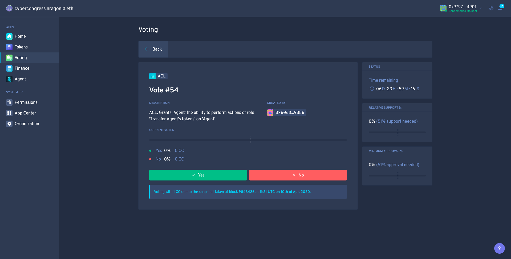
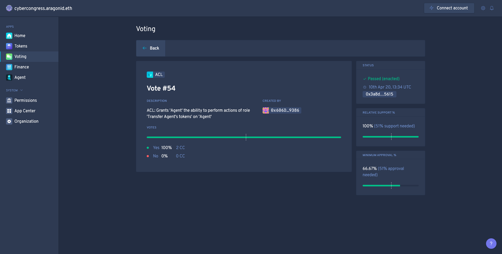
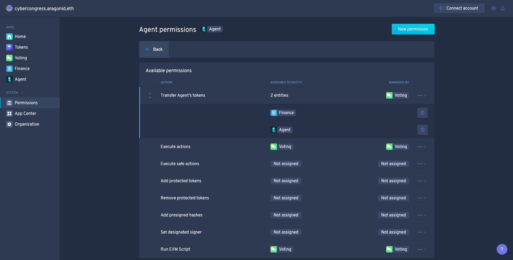

_________

## Deploy Aragon Company Template

Cyber Foundation will be DAO based on Company Aragon DAO Template. Use transferable tokens to represent ownership stake in DAO. Decisions are made based on stake-weighted voting. 

We deploying custom template because in cyber network tokens don't have decimals and we during vesting and claim process between Foundation and Cyber network (euler or cyber chains ids) we need to operate with zero decimals tokens.

### Changes

We need modify official template and change default token's decimals value. We need token with __zero decimals__.

1. Clone official Aragon DAO-Templates [repository](https://github.com/aragon/dao-templates/):
```
git clone https://github.com/aragon/dao-templates
cd dao-templates/templates/company
```

2. Change [one line](https://github.com/aragon/dao-templates/blob/master/templates/company/contracts/CompanyTemplate.sol#L14) and set TOKEN_DECIMALS to 0:
```
uint8 constant private TOKEN_DECIMALS = uint8(0); 
```

Diff of CompanyTemplate.sol
```
--- a/templates/company/contracts/CompanyTemplate.sol
+++ b/templates/company/contracts/CompanyTemplate.sol
@@ -11,7 +11,7 @@ contract CompanyTemplate is BaseTemplate, TokenCache {
     string constant private ERROR_BAD_PAYROLL_SETTINGS = "COMPANY_BAD_PAYROLL_SETTINGS";

     bool constant private TOKEN_TRANSFERABLE = true;
-    uint8 constant private TOKEN_DECIMALS = uint8(18);
+    uint8 constant private TOKEN_DECIMALS = uint8(0);
     uint256 constant private TOKEN_MAX_PER_ACCOUNT = uint256(0);
     uint64 constant private DEFAULT_FINANCE_PERIOD = uint64(30 days);

@@ -30,7 +30,7 @@ contract CompanyTemplate is BaseTemplate, TokenCache {
     * @param _tokenSymbol String with the symbol for the token used by share holders in the organization
     * @param _id String with the name for org, will assign `[id].aragonid.eth`
     * @param _holders Array of token holder addresses
-    * @param _stakes Array of token stakes for holders (token has 18 decimals, multiply token amount `* 10^18`)
+    * @param _stakes Array of token stakes for holders (token has 0 decimals)
     * @param _votingSettings Array of [supportRequired, minAcceptanceQuorum, voteDuration] to set up the voting app of the organization
     * @param _financePeriod Initial duration for accounting periods, it can be set to zero in order to use the default of 30 days.
     * @param _useAgentAsVault Boolean to tell whether to use an Agent app as a more advanced form of Vault app
@@ -66,7 +66,7 @@ contract CompanyTemplate is BaseTemplate, TokenCache {
     * @dev Deploy a Company DAO using a previously cached MiniMe token
     * @param _id String with the name for org, will assign `[id].aragonid.eth`
     * @param _holders Array of token holder addresses
-    * @param _stakes Array of token stakes for holders (token has 18 decimals, multiply token amount `* 10^18`)
+    * @param _stakes Array of token stakes for holders (token has 0 decimals)
     * @param _votingSettings Array of [supportRequired, minAcceptanceQuorum, voteDuration] to set up the voting app of the organization
     * @param _financePeriod Initial duration for accounting periods, it can be set to zero in order to use the default of 30 days.
     * @param _useAgentAsVault Boolean to tell whether to use an Agent app as a more advanced form of Vault app
@@ -95,7 +95,7 @@ contract CompanyTemplate is BaseTemplate, TokenCache {
     * @dev Deploy a Company DAO using a previously cached MiniMe token
     * @param _id String with the name for org, will assign `[id].aragonid.eth`
     * @param _holders Array of token holder addresses
-    * @param _stakes Array of token stakes for holders (token has 18 decimals, multiply token amount `* 10^18`)
+    * @param _stakes Array of token stakes for holders (token has 0 decimals)
     * @param _votingSettings Array of [supportRequired, minAcceptanceQuorum, voteDuration] to set up the voting app of the organization
     * @param _financePeriod Initial duration for accounting periods, it can be set to zero in order to use the default of 30 days.
     * @param _useAgentAsVault Boolean to tell whether to use an Agent app as a more advanced form of Vault app
```

### Deploy
Command (cast tx):
```
npm run deploy:<network>
```
Output:
```
=========
# CompanyTemplate:
Address: 0x47a5f974312b254395d329d6de5b264e0579bbb1
Transaction hash: 0x7286d11d2276268c24b620f245b78e0e1c2bebe3d82e83ab55d6d1386684fb29
Compiler: solc@0.4.24+commit.e67f0147.Emscripten.clang (Optimizer: 10000 runs)
Compiled at: 2020-01-19T11:38:01.984Z
=========
```

### Verity on Etherscan
Prepare single file with needed code to verification.
```
truffle-flattener CompanyTemplate.sol > CompanyTemplateFull.sol
```
And then use Etherscan Verificatoin service to verify contract. Set optimization to enabled with __10000 runs__.

Link to verified template [contract](https://rinkeby.etherscan.io/address/0x47a5f974312b254395d329d6de5b264e0579bbb1#code) on Etherscan
__________

## Vesting & Auction Aragon applications

Repositories:
- [Vesting application](https://github.com/cybercongress/aragon-vesting-app)
- [Auction application](https://github.com/cybercongress/aragon-auction-app)

### About Vesting application [IPMROVE!]
The Vesting app is used to vest your cyber~Foundation {GOL, THC} tokens until the end of cyber~Auction. It is also used to claim an equivalent, 1-to-1, amount of tokens in the Cyber blockchain (if the Foundation tokens are vested). 

Your tokens will be locked for transfer for the duration of the auction. But, are available to be used for participating in the governance of the DAO.

After the end of the auction and the finalization of the distribution, the tokens will be unlocked for transfer. From this point onwards, cyber~Congress will no longer be responsible for their transfer.

If you not vest your tokens your tokens freely available for transfers and for example, for trading on Uniswap.
In both cases value of Foundation tokens is participating in governance of Foundation and also claiming of associated amount of tokens in Cyber chain.f

Features:
- Vest and lock user tokens for transfers, until a set date
- Creation of claims
- Process user claims state

### About Auction application [IPMROVE!]

With Auction application agents may purchase tokens allocated to distibution with Foundation.
There are rounds where the zero round in more longer than others and on which more tokens distribute. Other rounds have equal length and equal amount for distribution.

Agent may ethers to auction for any round they desire but auctioned amount of tokens will be available for transferring e.g claim from auction only when given round passed.

Agent takes tokens proportionally to amount of ether he invest to whole amount of ethers which was donated during given round.

Accumalated ethers at any time available to transferring to Foundation Aragon Agent's by agent and participant of auction at any time and then me controlled by governance.

Features:
- Buy tokens
- Claim tokens
- Collect ETH to foundation

### Deploy to Aragon Package Manager (APM)

Note: deployer to APM and owner of deployed repositories in APM is account [0x5eB63fC9837EAB21192eEB5250BE3EFd239b87f0](https://rinkeby.etherscan.io/address/0x5eB63fC9837EAB21192eEB5250BE3EFd239b87f0)

This goes from project root directory and will publish packages to APM.
```
aragon apm publish major --environment aragon:rinkeby --files dist --use-frame

  ↓ Start IPFS [skipped]
  ✔ Applying version bump (major)
  ✔ Building frontend
  ✔ Deploy contract
  ✔ Determine contract address for version
  ✔ Prepare files for publishing
  ✔ Generate application artifact
  ✔ Publish intent

 The following information will be published:
 Contract address: 0xa0e62B76E624DA3eD06f398A7dA9976Ac4ce045D
 Content (ipfs): QmcVdvhYsEaknbL3HWeqRZxfPh3YZjPMceY4VXdEKdN3Q4

? Publish to cyberauction.open.aragonpm.eth repo Yes

  ✔ Publish cyberauction.open.aragonpm.eth

 Successfully published cyberauction.open.aragonpm.eth v7.0.0 :

Transaction hash: 0x8e06e6fc5ec22c32821327abaa7616f18ec42a2a3c08c3d44456156b6c2fe62c

? Propagate content No
```

Auction Deployment Information:
```
commitHash: f09e88a11ae788a0924997aa3e80cdb5b70baed3
contractAddress: 0xa0e62B76E624DA3eD06f398A7dA9976Ac4ce045Dg
date:
ipfsHash: QmcVdvhYsEaknbL3HWeqRZxfPh3YZjPMceY4VXdEKdN3Q4
txHash: 0x8e06e6fc5ec22c32821327abaa7616f18ec42a2a3c08c3d44456156b6c2fe62c
```

Vesting Deployment Information:
```
commitHash: 03feb4ead6c01421cb35524d43428bffc18ea86e
contractAddress:
date:
ipfsHash: Qmcz48Le7ZKYE4zX1e5eDc2ntyxKj294qG6NcUyBXMDLto
txHash:
```

### Propagate application to IPFS
```
npx aragon ipfs propagate <CID>
```
Better to repeat propagation procedure couple of times.

```
aragon ipfs propagate Qme7yuXPU8ev3kx7jaH32ph4V9bTWm46V27bJju4QEviBa
  
  ✔ Check IPFS
  ✔ Connect to IPFS
  ✔ Fetch the links
  ✔ Query gateways

 Queried 29 CIDs at 7 gateways 
 Requests succeeded: 129 
 Requests failed: 74 
```
To provide good service need to pin also applications frontend to as much as available IPFS nodes, better to your own disributed IPFS cluster.

Recommend to add this peer to your node swarm:
```
ipfs swarm connect /ip4/134.209.179.153/tcp/4001/ipfs/QmU7j23HQx6Z3kYTnGv3YUxftVLUrtdt35nTdK5uKVajVu
```

After this Vesting application will be available to install from __cybervesting.open.aragonpm.eth__ and Auction from __cyberauction.open.aragonpm.eth__.

Note: If you fail with this step then try use @aragon/cli v7.0.2 for publish and v6.4.4 for propagation.

You can also pin content for better discovery throught IPFS with this command:
```
ipfs pin add <CID>
```
or with your own IPFS cluster:
```
ipfs-cluster-ctl pin add <CID>
```

#### TODO 
1. add information on apm packages holder

___________

## Cyber Foundation DAO

Here we will deploy Foundation DAO by Congress Agent. DAO deploy consist from two steps: deploy of token and DAO itself. This deploys requiers a lot of gas so there will be two transactions: newToken and newInstance which we will call on prepared template. During token deploy address of newly created token contract instance will be cached to caller and then this cache will be used to initialize DAO on next step.

The awesome thing there that DAO will be created by extra actor - Agent of Congress, which described before and will realize our intents.

### Create proposal to deploy token by Congress Agent
Command template (cast tx):
```
npx dao act <agentCongressAddress> <companyTemplateAddress> "newToken(string,string)" "<name>" "<ticker>" --environment aragon:<network>
```
Command (cast tx):
```
npx dao act 0x988fbf6ee7219c0672351605ccc16060ed31d703  0x47a5f974312b254395d329d6de5b264e0579bbb1 "newToken(string,string)" "tgol26" "TGOL26" --environment aragon:rinkeby --use-frame
```
Output:
```
  ⠙ Executing execute on 0xaAe1456bDEDaa40E2ecf20777Fab7Ec2f676477f
  ✔ Executing execute on 0xaAe1456bDEDaa40E2ecf20777Fab7Ec2f676477f

✔ Successfully executed: "Execute desired action as a token holder"
```

[Transaction details of Foundation's Token Deploy proposal in Congress](https://rinkeby.etherscan.io/tx/0xdbe285b341a9088ce66b2125bc07d59fc5c0f14a2170eca62493ee3dae3636d2)

### Create proposal to deploy DAO by Congress Agent

Notes:
- Use holders addresses in params without 0x
- Use ```"[\"<value>\", \"<value>\"]"``` for arrays 
- For support and approval ```X%``` is ```X0000000000000000``` (ex: 500000000000000000 is 50%)
- Vor vote duration time in seconds (ex: 1200 is 20 minutes)
- Finance period set default to 0
- Install Agent with true

Template of Transaction:
```
dao act <agentCongressAddress> <companyTemplateAddress> "newInstance(string,address[],uint256[],uint64[3],uint64,bool)" "<nameDAO>"  "[\"<holder1>\"]" "[\"<balance1>\"]" "[\"<support>\",\"<approval>\",\"<timeToVote>\"]" <financePeriod> <installAgent> --environment aragon:<network>
```

Note on Voting params values:
```
TODO
```
Params:
- Supply: 700T TGOL22 + 1 TGOL22 (for proposals, will be burned)
- Support: 51% (500000000000000000)
- Approval: 20% (200000000000000000)
- Voting time: 2 weeks (1209600)

Note on extra account:

Attention. We issue the whole needed supply to congress's agent but also adding here 1 extra account with only 1 token. This needed because now possible but very hard to construct a set of transactions that allow to the agent of one dao as the token holder in another dao guide agent of this dao for actions. And all this should turn around proposals for each action... Our solution to not over complicate set up and use a service account for each will be issued 1 extra token (which will be burned after he completes his mission) and this will allow them to create transactions in Foundation DAO and create a proposals too. But their weight will not allow influencing any proposal (and this not needed).

Command (cast tx):
```
dao act 0x988fbf6ee7219c0672351605ccc16060ed31d703 0x47a5f974312b254395d329d6de5b264e0579bbb1 "newInstance(string,address[],uint256[],uint64[3],uint64,bool)" "tgol26" "[\"64a69701D6b52422150F4E373B86Fb334477ec7a\",\"988fbf6ee7219c0672351605ccc16060ed31d703\"]" "[\"1\",\"700000000000000\"]" "[\"500000000000000000\",\"200000000000000000\",\"1209600\"]" 0 true --environment aragon:rinkeby --use-frame
```

Output:
```
  ⠙ Executing execute on 0xaAe1456bDEDaa40E2ecf20777Fab7Ec2f676477f
  ✔ Executing execute on 0xaAe1456bDEDaa40E2ecf20777Fab7Ec2f676477f

✔ Successfully executed: "Execute desired action as a token holder"
```

[Transaction details of Foundation DAO deploy proposal in Congress](https://rinkeby.etherscan.io/tx/0xb1a9411af333b97b8fe86075f635db62a83079f85e6eb95df24841537a5d2f03)

### Vote for token and DAO deploy by Cyber Congressmans


#### Votes for token deploy
[Vote #1](https://rinkeby.etherscan.io/tx/0x7ed48928db5c2a26643a627526be2b2d36f58f34d78371c0bb33f938c53dcba3) and [Vote #2](https://rinkeby.etherscan.io/tx/0x88788f46bded31c8469dd41edc68395f4cafe17292490e62efcca78dbd7913dd)

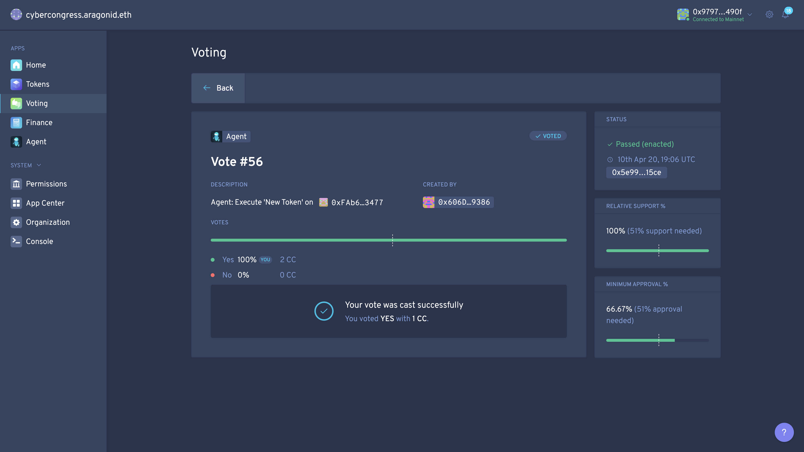

#### Votes for foundation deploy
[Vote #1](https://rinkeby.etherscan.io/tx/0xd2b8b5ecc123fd5c01fba0ca9d6c70c8db096d60cf84d79092fca77828d51064) and [Vote #2](https://rinkeby.etherscan.io/tx/0x46351e06a03b33f257b2f01592e5b9ff67ccd457e8720fd6261c3ffab086f618)

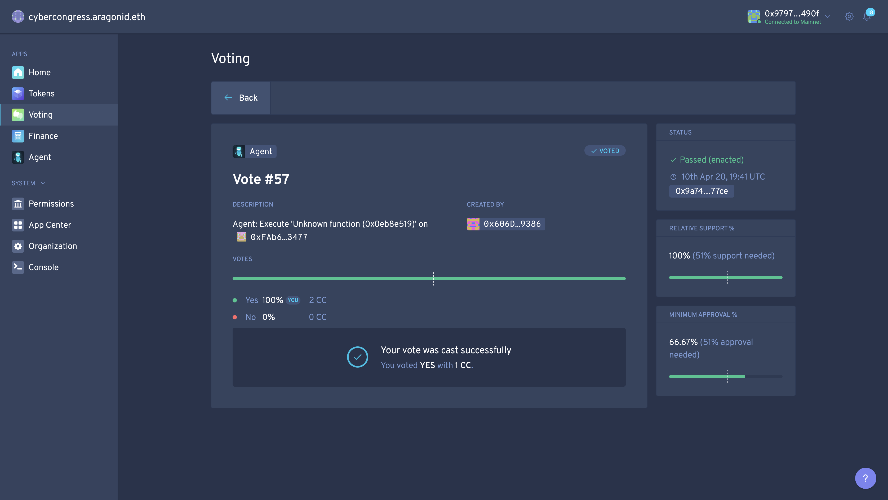


After proposal passed new DAO [available](https://rinkeby.aragon.org/#/tgol26)
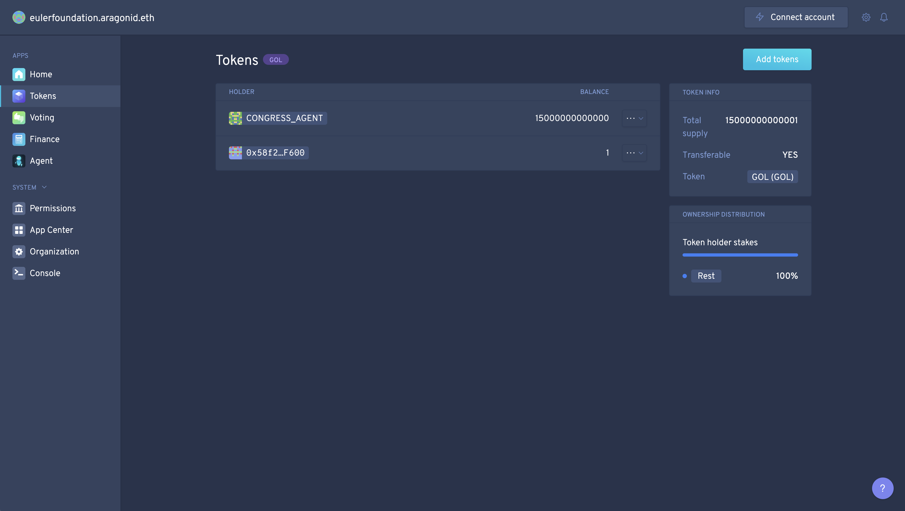

First and major holder here is Congress' Agent and second one is service account which was described before.

### Check Foundation DAO
This command allows you to check installed applications and addresses of their instances also check a permissionless application (which installed and initialized but need to set up needed permission to start their operations). 

Template of command:
```
npx dao apps <kernelFoundationAddress> --all --environment aragon:<network>
```

Command (not cast tx):
```
npx dao apps 0x7961b06c10B41A99eF574f2372D279a48C1D0Ff8  --all --environment aragon:rinkeby
```
Output:
```
  ⠙ Inspecting DAO
  ✔ Inspecting DAO
  ✔ Fetching permissionless apps

✔ Successfully fetched DAO apps for 0x7961b06c10B41A99eF574f2372D279a48C1D0Ff8
┌──────────────────────┬────────────────────────────────────────────┬─────────────────────────────────────────────────────┐
│ App                  │ Proxy address                              │ Content                                             │
├──────────────────────┼────────────────────────────────────────────┼─────────────────────────────────────────────────────┤
│ kernel               │ 0x7961b06c10B41A99eF574f2372D279a48C1D0Ff8 │ (No UI available)                                   │
├──────────────────────┼────────────────────────────────────────────┼─────────────────────────────────────────────────────┤
│ acl                  │ 0x3c81424a236b8105ad089425552a5c5dc16f9bad │ (No UI available)                                   │
├──────────────────────┼────────────────────────────────────────────┼─────────────────────────────────────────────────────┤
│ evmreg               │ 0x7009e48641fb1f246639b60e859612192ee29384 │ (No UI available)                                   │
├──────────────────────┼────────────────────────────────────────────┼─────────────────────────────────────────────────────┤
│ token-manager@v2.1.7 │ 0xc53914fddba1357da7ccc09d193f3b72d5e652a6 │ ipfs:QmdLEDDfiH3RGjbgU5hqJwwALbNreMWupqTQCRGfNrMPiP │
├──────────────────────┼────────────────────────────────────────────┼─────────────────────────────────────────────────────┤
│ agent@v5.0.1         │ 0x53b892babeb4a7044ec23d0b0c7c53eeb0d0ecae │ ipfs:QmXBnAn37C813nLSHtLL3EcCsYSJS6k5kK15QcmD6DvHNZ │
├──────────────────────┼────────────────────────────────────────────┼─────────────────────────────────────────────────────┤
│ finance@v2.1.9       │ 0x63f83cee5f74f9439ac9dc11b58dd85fd7ca24b0 │ ipfs:QmbnhuLvvvcqEpRXd6VtnqZYAFZJdvAnhUrBAwqE1rfeRP │
├──────────────────────┼────────────────────────────────────────────┼─────────────────────────────────────────────────────┤
│ voting@v2.1.7        │ 0x7c2e8bec18dbe0d0fb1ba2920824444c164aaf7f │ ipfs:QmUvWBZqpKepDwS5WUsTTURwiBRvhoGRTjwJG7Em5TU2UJ │
└──────────────────────┴────────────────────────────────────────────┴─────────────────────────────────────────────────────┘
```

### Voting by Congress Agent in Foundation
Create proposal to vote YES/NO in proposal in another DAO
```
dao act <agentCongressAddress> <foundationVotingAppAddress>  "vote(uint256,bool,bool)" <id> <vote> <enact>  --environment aragon:<network>
```
Note: to forward intent of Congressmen to another DAO will be used Agent of Congress. One of congressman's creates proposal to vote yes or no for giving proposals in another DAO and call Congress Agent for this giving them voting application instance of another DAO and proposal ID and decision which need to apply. After the proposal passing agent will forward a vote to the given proposal in another DAO.
____________

## Install Vesting application to Foundation

## Parameters
Params:
```
address _tokenManager, 
uint64 _vestingEnd
```

Params:
- Token Manager - 0xc53914fddba1357da7ccc09d193f3b72d5e652a6
- Vesting End - Wednesday, April 1, 2020 1:00:00 AM GMT (1585702800)

Note: Vesting application needs token manager address of Foundation DAO because it creates vestings (token manager functionality) and call issue, assing and burns operation on the token manager. Vesting end time it is time when given vesting's token will be allowed for transfer again. Time set up follow distribution agreement (needs to auction to be completed) plus a certain amount of time (window for holders to make vestings after whole auction end and dust from the auction will provable burned by Congress). After vesting end time Congress will stop its commitment to provide claims for Cyb tokens in the Cyber chain.

### Install application 

Note: this action goes by service account

Command template (cast tx):
```
npx dao install <kernelFoundationAddress> cyberclaim.open.aragonpm.eth latest --app-init-args <tokenManagerFoundationAddress> <vestingEnd> --environment aragon:rinkeby
```

Command (cast tx):
```
npx dao install 0x7961b06c10B41A99eF574f2372D279a48C1D0Ff8 cybervesting.open.aragonpm.eth latest --app-init-args 0xc53914fddba1357da7ccc09d193f3b72d5e652a6 1585702800 --environment aragon:rinkeby --use-frame
```
Output:
```
  ✔ Fetching cybervesting.open.aragonpm.eth@latest
  ✔ Fetching cybervesting.open.aragonpm.eth@latest
  ↓ Checking installed version [skipped]
    → Installing the first instance of cybervesting.open.aragonpm.eth in DAO
  ✔ Deploying app instance
  ↓ Fetching deployed app [skipped]
    → App wasn't deployed in transaction.

ℹ Successfully executed: "Execute desired action as a token holder"

⚠ After the app instance is created, you will need to assign permissions to it for it appear as an app in the DAO
```

[Transaction details on proposal to install Vesting application in Foundation](https://rinkeby.etherscan.io/tx/0x64eebe72bbafcbb863af13d5b635d82d404ebe9b36d96a93cd82891da6450dd1)

Proposal to install Vesting application created in Foundation DAO:


After that we need to vote for this proposal with Congress agent. One of congressmans creates proposal to vote YES for this proposal in Foundation DAO in Congress DAO.

Command template (cast tx):
```
dao act <agentCongressAddress> <foundationVotingAddress>  "vote(uint256,bool,bool)" <id> <vote> <enact>  --environment aragon:<network>
```
Command (cast tx):
```
dao act 0x988fbf6ee7219c0672351605ccc16060ed31d703 0x7c2e8bec18dbe0d0fb1ba2920824444c164aaf7f "vote(uint256,bool,bool)" 0 true true  --environment aragon:rinkeby --use-frame
```
Output:
```
  ⠙ Executing execute on 0xaAe1456bDEDaa40E2ecf20777Fab7Ec2f676477f
  ✔ Executing execute on 0xaAe1456bDEDaa40E2ecf20777Fab7Ec2f676477f

✔ Successfully executed: "Execute desired action as a token holder"
```

Here congressmans votes YES to proposal in Foundation DAO to install Vesting application in cyber~Congress DAO:


[Vote #1 Tx](https://rinkeby.etherscan.io/tx/0xc75f1096758c0dd37b033f623afc9321c568ec36e82f8b2186b1081e6d988dfa) and [Vote #2 Tx](https://rinkeby.etherscan.io/tx/0xf6accd0cf47b67415ae54ed486471cb55188335f505bf355abf0c9d3acdf6a00)

Proposal passed in Foundation DAO:


Note: Now Vesting application is permissionless. To complete installation process we need to assign permissons to Vesting application.
```
  ⠙ Inspecting DAO
  ✔ Inspecting DAO
  ✔ Fetching permissionless apps

✔ Successfully fetched DAO apps for 0x7961b06c10B41A99eF574f2372D279a48C1D0Ff8
┌──────────────────────┬────────────────────────────────────────────┬─────────────────────────────────────────────────────┐
│ App                  │ Proxy address                              │ Content                                             │
├──────────────────────┼────────────────────────────────────────────┼─────────────────────────────────────────────────────┤
│ kernel               │ 0x7961b06c10B41A99eF574f2372D279a48C1D0Ff8 │ (No UI available)                                   │
├──────────────────────┼────────────────────────────────────────────┼─────────────────────────────────────────────────────┤
│ acl                  │ 0x3c81424a236b8105ad089425552a5c5dc16f9bad │ (No UI available)                                   │
├──────────────────────┼────────────────────────────────────────────┼─────────────────────────────────────────────────────┤
│ evmreg               │ 0x7009e48641fb1f246639b60e859612192ee29384 │ (No UI available)                                   │
├──────────────────────┼────────────────────────────────────────────┼─────────────────────────────────────────────────────┤
│ token-manager@v2.1.7 │ 0xc53914fddba1357da7ccc09d193f3b72d5e652a6 │ ipfs:QmdLEDDfiH3RGjbgU5hqJwwALbNreMWupqTQCRGfNrMPiP │
├──────────────────────┼────────────────────────────────────────────┼─────────────────────────────────────────────────────┤
│ agent@v5.0.1         │ 0x53b892babeb4a7044ec23d0b0c7c53eeb0d0ecae │ ipfs:QmXBnAn37C813nLSHtLL3EcCsYSJS6k5kK15QcmD6DvHNZ │
├──────────────────────┼────────────────────────────────────────────┼─────────────────────────────────────────────────────┤
│ finance@v2.1.9       │ 0x63f83cee5f74f9439ac9dc11b58dd85fd7ca24b0 │ ipfs:QmbnhuLvvvcqEpRXd6VtnqZYAFZJdvAnhUrBAwqE1rfeRP │
├──────────────────────┼────────────────────────────────────────────┼─────────────────────────────────────────────────────┤
│ voting@v2.1.7        │ 0x7c2e8bec18dbe0d0fb1ba2920824444c164aaf7f │ ipfs:QmUvWBZqpKepDwS5WUsTTURwiBRvhoGRTjwJG7Em5TU2UJ │
└──────────────────────┴────────────────────────────────────────────┴─────────────────────────────────────────────────────┘
┌────────────────────────────────────────────────────────────────────┬────────────────────────────────────────────┐
│ Permissionless app                                                 │ Proxy address                              │
├────────────────────────────────────────────────────────────────────┼────────────────────────────────────────────┤
│ 0xb3898b383ac8a6bae742b41163ced5666086e3e367be1b3de9251c2dbc45d412 │ 0x7C2a661daC04aaE4381b810c3228cCaB1d11Deec │
└────────────────────────────────────────────────────────────────────┴────────────────────────────────────────────┘
```

### Initialize Proof/Pause Roles

__Pause Role__ - assigning this to Congress Agent will allow Congress following aggrement stop vestings and claiming of CYB following crisis protocol;

__Proof Role__ - assigning this to Congress driven external address will allow Congress send tokens and then write transactions as proofs to given vestings created by agents.

We are setting also managers of this roles to congress agent (add more)

Command template (cast tx):
```
npx dao acl create <kernelFoundationAddress> <vestingApplicationAddress> PAUSE_ROLE <agentCongressAddress> <agentCongressAddress> --environment aragon:<network>
```

Command (cast tx):
```
dao acl create 0x7961b06c10B41A99eF574f2372D279a48C1D0Ff8 0x7C2a661daC04aaE4381b810c3228cCaB1d11Deec PAUSE_ROLE 0x988fbf6ee7219c0672351605ccc16060ed31d703 0x988fbf6ee7219c0672351605ccc16060ed31d703 --environment aragon:rinkeby --use-frame
```
Output:
```
  ⠙ Executing createPermission on 0x7961b06c10B41A99eF574f2372D279a48C1D0Ff8
  ✔ Executing createPermission on 0x7961b06c10B41A99eF574f2372D279a48C1D0Ff8

✔ Successfully executed: "Execute desired action as a token holder"
``` 

[Transaction details on install PAUSE_ROLE on Vesting application](https://rinkeby.etherscan.io/tx/0x9da2131301429862a12f510806ef8f262f07035cd5b68888a3a5802bdfa050df)

Command template (cast tx):
```
dao acl create <kernelFoundationAddress> <claimAppAddress> PROOF_ROLE <prooferAddress> <agentCongressAddress> --environment aragon:<network>
```

Command (cast tx):
```
dao acl create 0x7961b06c10B41A99eF574f2372D279a48C1D0Ff8 0x7C2a661daC04aaE4381b810c3228cCaB1d11Deec PROOF_ROLE 0x31c3F97575B7515a7e967f73Cb26c5BFD7898951 0x988fbf6ee7219c0672351605ccc16060ed31d703 --environment aragon:rinkeby --use-frame
```
Output:
```
  ⠼ Executing createPermission on 0x7eFA8E568a5fE91741f72A39b96f42EEdB67C419
  ✔ Executing createPermission on 0x7eFA8E568a5fE91741f72A39b96f42EEdB67C419

✔ Successfully executed: "Execute desired action as a token holder"
```

[Transaction details on install PROOF_ROLE on Vesting application](https://rinkeby.etherscan.io/tx/0xa6a085437705033b3fdbd181870edfff5081acfc81ac73c6f682f1fdcf21fcb8)

Created proposals in Foundation DAO:


Create proposal to vote:
```
dao act 0x988fbf6ee7219c0672351605ccc16060ed31d703 0x7c2e8bec18dbe0d0fb1ba2920824444c164aaf7f "vote(uint256,bool,bool)" 1 true true  --environment aragon:rinkeby
```
```
  ⠙ Executing execute on 0xaAe1456bDEDaa40E2ecf20777Fab7Ec2f676477f
  ✔ Executing execute on 0xaAe1456bDEDaa40E2ecf20777Fab7Ec2f676477f

✔ Successfully executed: "Execute desired action as a token holder"
```
[Transaction details on create voting in Congress for setting PAUSE_ROLE on Vesting](https://rinkeby.etherscan.io/tx/0x3c56d2efe4888e581726fa583a679779860d7cc983b90620c865bc945faaf652)

Create proposal to vote:
```
dao act 0x988fbf6ee7219c0672351605ccc16060ed31d703 0x7c2e8bec18dbe0d0fb1ba2920824444c164aaf7f "vote(uint256,bool,bool)" 2 true true  --environment aragon:rinkeby
```
```
  ⠙ Executing execute on 0xaAe1456bDEDaa40E2ecf20777Fab7Ec2f676477f
  ✔ Executing execute on 0xaAe1456bDEDaa40E2ecf20777Fab7Ec2f676477f

✔ Successfully executed: "Execute desired action as a token holder"
```
[Transaction details on create voting in Congress for setting PROOF_ROLE on Vesting](https://rinkeby.etherscan.io/tx/0x3ca7290ab854b41da1f44f3bc2e0c5060532f3b759c24efc752d7032a83f0bb6)

Created proposals in Congress DAO:
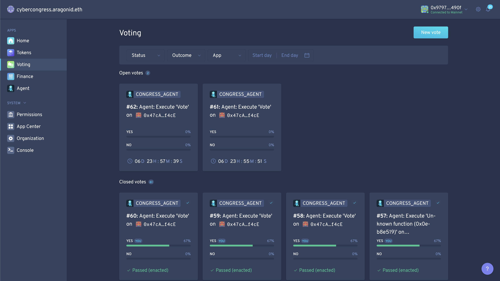

Passed proposals which forward YESs votings to Fondation DAO:


[Vote #1](https://rinkeby.etherscan.io/tx/0xaaf59921ab7c4e2b7663f0c6a3f7817dfcf04dd7bb514d94c7c10384bbcef2c6) and [Vote #2](https://rinkeby.etherscan.io/tx/0xe471ca20104850284f61e56f5781a3d527b41f1640edafc4fcbf8501338e7bfa)


[Vote #1](https://rinkeby.etherscan.io/tx/0x7e570798f37d9b3b4a85f33960058923d84358b3603042f33277ec7ef9ed80a2) and [Vote #2](https://rinkeby.etherscan.io/tx/0x1f9ff63ced2a86fac2cc0c3e2d8940ef1ea1ed16e33e6bae01442a5d705d9849)

Passed proposals in Foundation DAO:
(and here we also see that cyber~Vesting application is now available)


Permissions of Auction in Foundation DAO are installed:


## Grant permission to Issue/Assign/Burn on Token Manager 

Now we need to grant needed permissions to Vesting application for use needed function of Token Manager of Foundation DAO.

Note: This action goes from frontend application

1. Issue - initialize with entity Vesting Application and Voting application as manager
2. Assing - initialize with entity Vesting Application and Voting application as manager
3. Burn - grant permission to entity Vesting Application 


- [Transaction details](https://rinkeby.etherscan.io/tx/0xd8e1003152602e8bcccc006de2568d44f34e37951fe4f3a6ac70c65ab56d2ace)


- [Transaction details](https://rinkeby.etherscan.io/tx/0x25344d300fb4477717be1d9523780a3a50b8457245a3bd348883433c6e269be5)


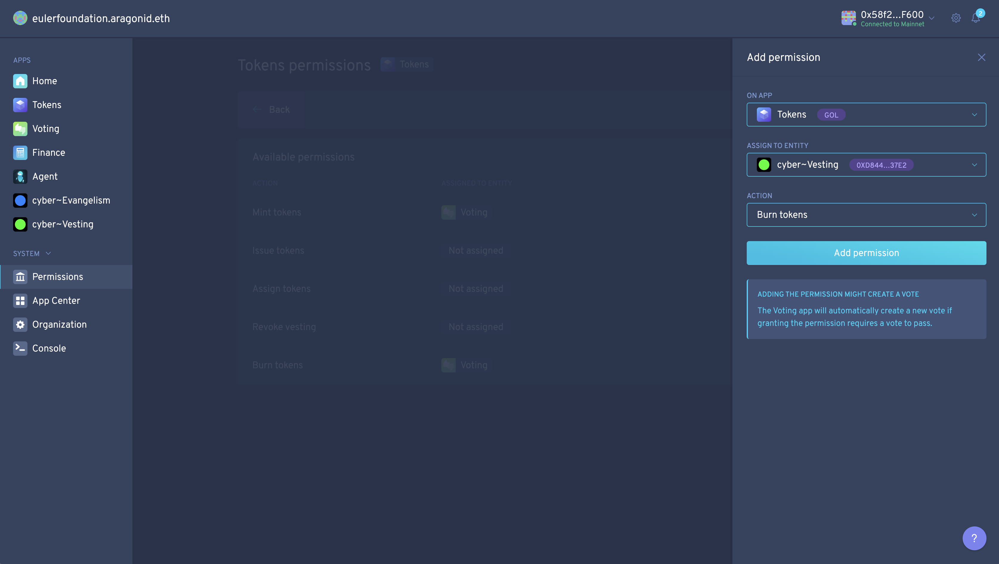
- [Transaction details](https://rinkeby.etherscan.io/tx/0x7385f2bdaaa52650b54f8b7f390e31c76ba65a36005aafc8d4826aea06e91cf2)


After that create 3 votings:
```
dao act <agentCongressAddress> <foundationVotingAddress>  "vote(uint256,bool,bool)" <id> <vote> <enact>  --environment aragon:<network>
```
```
dao act 0x988fbf6ee7219c0672351605ccc16060ed31d703 0x7c2e8bec18dbe0d0fb1ba2920824444c164aaf7f "vote(uint256,bool,bool)" 3 true true  --environment aragon:rinkeby --use-frame
```
- [Transaction details on creating proposal on Issue token permission](https://rinkeby.etherscan.io/tx/0xd3c9ed31d992fac397d9efb5b07691ebc563f4138f7c3361a3bbb7366b9a39fb)
```
dao act 0x988fbf6ee7219c0672351605ccc16060ed31d703 0x7c2e8bec18dbe0d0fb1ba2920824444c164aaf7f "vote(uint256,bool,bool)" 4 true true  --environment aragon:rinkeby --use-frame
```
- [Transaction details on creating proposal on Assign tokens permission](https://rinkeby.etherscan.io/tx/0xf09d530f2b76a59eeceb949ca63c94fe2abe6111b8dbe8d6be4dc66c9adf34fc)
```
dao act 0x988fbf6ee7219c0672351605ccc16060ed31d703 0x7c2e8bec18dbe0d0fb1ba2920824444c164aaf7f "vote(uint256,bool,bool)" 5 true true  --environment aragon:rinkeby --use-frame
```
- [Transaction details on creating proposal on Burn tokens permission](https://rinkeby.etherscan.io/tx/0xee1015799d6b0cc13b0212399d130b78c7619b2590daa0a13589a18398a0dc6e)

Ouputs:
```
  ⠸ Executing execute on 0xaAe1456bDEDaa40E2ecf20777Fab7Ec2f676477f
  ✔ Executing execute on 0xaAe1456bDEDaa40E2ecf20777Fab7Ec2f676477f

✔ Successfully executed: "Execute desired action as a token holder"
```


Congressmans votes on this proposals and forward YES votes to proposals which sets permission on Token Manager in Foundation DAO granting following permissions to Vesting application.


[Vote #1](https://rinkeby.etherscan.io/tx/0x2679df561fd4e4a0246a0e0173390d7d4f12fe122086a4cfe8ed629c452a798f) and [Vote #2](https://rinkeby.etherscan.io/tx/0x38b128d01e16e06fe60c841ddc3a16e21e351ead7129613e55842a76f1d3e613)


[Vote #1](https://rinkeby.etherscan.io/tx/0x51df69437bba518ddd93914919dc6666d7aac784a74c257d60392bb4a12c3896) and  [Vote #2](https://rinkeby.etherscan.io/tx/0xc172ecb9492189919df6f5ad3b2a973ceca8e4b1625a30165340d81cede8e142)


[Vote #1](https://rinkeby.etherscan.io/tx/0xd1bf9e7f063f7da9139143b9487bc572f4686d32730d80c9707b797c56572f15) and   [Vote #2](https://rinkeby.etherscan.io/tx/0xf234d5fb27d48413ecd78d0969765e22ba3337b54de712511d40bd9879f8058b)

Proposals passed in Foundation DAO:


New permissions on Token Manager in Foundation DAO:


Installation of Vesting application in Foundation DAO is completed, application is fully operational.
____________

## Install Auction application to Foundation

### Parameters

Parameters:
```
uint256 _numberOfDays,
uint256 _openTime,
uint256 _startTime,
MiniMeToken _token,
address _foundation,
address _tokenManager
```

- Number of days is amount of windows/rounds of given time (23 hours + 1 second) auction will continue after zero window.
- Open time is time when zero round will begin (Ethreum's part of Game of Thrones)
- Start time is time when zero found will be finished and equal time rounds will start.
- Foundation address is address to which collected Ethers will be transferred (Foundation's DAO agent)

```
- numberOfDays - 20
- openTime -  1585245600 Thursday, March 26, 2020 6:00:00 PM GMT
- startTime - 1585591200 Monday, March 30, 2020 6:00:00 PM GMT
- token - Foundation token TGOL26 (0xf6e8E6730d8E3F48519f150215013d654d43a53B)
- foundation - Agent of Foundation (0x53b892babeb4a7044ec23d0b0c7c53eeb0d0ecae)
```

### Install
Command template (cast tx):
```
dao install <kernel> cyberauction.open.aragonpm.eth latest --app-init-args <windows> <open> <start> <token> <agentFoundationAddress> <tokenManagerAddress> --environment aragon:rinkeby
```
Command (cast tx):
```
dao install 0x7961b06c10B41A99eF574f2372D279a48C1D0Ff8 cyberauction.open.aragonpm.eth latest --app-init-args 20 1585245600 1585591200 0xf6e8E6730d8E3F48519f150215013d654d43a53B 0x53b892babeb4a7044ec23d0b0c7c53eeb0d0ecae  0xc53914fddba1357da7ccc09d193f3b72d5e652a6 --environment aragon:rinkeby --use-frame
```
Output:
```
  ✔ Fetching cyberauction.open.aragonpm.eth@latest
  ✔ Fetching cyberauction.open.aragonpm.eth@latest
  ↓ Checking installed version [skipped]
    → Installing the first instance of cyberauction.open.aragonpm.eth in DAO
  ✔ Deploying app instance
  ↓ Fetching deployed app [skipped]
    → App wasn't deployed in transaction.

ℹ Successfully executed: "Execute desired action as a token holder"

⚠ After the app instance is created, you will need to assign permissions to it for it appear as an app in the DAO
```
[Transaction details on creating proposal in Foundation for install Auction application](https://rinkeby.etherscan.io/tx/0xe89535503a65ed5f3d9ec56510c1799c9b63f5eabdfeef1b1dffd5b0e282ab5c)

Proposal to install Auction in Foundation DAO created:


### After create voting in for vote YES by Congress' Agent in Congress and Vote
Command (cast tx):
```
dao act 0x2d0970da60f36be926f78fbe8d6ef035eeaaf09f 0x519bc4f0b24f9bf5c093f7cfdaf962a3bd15f414 "vote(uint256,bool,bool)" 6 true true  --environment aragon:rinkeby
```
```
⠸ Executing execute on 0xaAe1456bDEDaa40E2ecf20777Fab7Ec2f676477f
  ✔ Executing execute on 0xaAe1456bDEDaa40E2ecf20777Fab7Ec2f676477f

✔ Successfully executed: "Execute desired action as a token holder"
```
[Transaction details on creating proposal in Congress to vote on proposal in Foundation for installing Auction application](https://rinkeby.etherscan.io/tx/0xb9d077e50861c457d9aae51033116f6a88b92717e9b9d5c44798fc7003e07298)

Created proposal to vote YES in Congress DAO:


Passed proposal in Congress DAO:


[Vote 1](https://rinkeby.etherscan.io/tx/0xa78f1e393d0ad1dc1f951995b15ffada45605e6fad5d6cccf26f6f72d5dbfbaf) and [Vote 2](https://rinkeby.etherscan.io/tx/0x46ef0e1313b5a1529e09723cee2142842d9e64660256061106fabe9d08f09dd5)

Passed proposal in Foundation DAO to install Auction application:


```
➜  ~ npx dao apps 0x7eFA8E568a5fE91741f72A39b96f42EEdB67C419 --all --environment aragon:rinkeby
  ⠙ Inspecting DAO
  ✔ Inspecting DAO
  ✔ Fetching permissionless apps

✔ Successfully fetched DAO apps for 0x7961b06c10B41A99eF574f2372D279a48C1D0Ff8
┌──────────────────────────┬────────────────────────────────────────────┬─────────────────────────────────────────────────────┐
│ App                      │ Proxy address                              │ Content                                             │
├──────────────────────────┼────────────────────────────────────────────┼─────────────────────────────────────────────────────┤
│ kernel                   │ 0x7961b06c10B41A99eF574f2372D279a48C1D0Ff8 │ (No UI available)                                   │
├──────────────────────────┼────────────────────────────────────────────┼─────────────────────────────────────────────────────┤
│ acl                      │ 0x3c81424a236b8105ad089425552a5c5dc16f9bad │ (No UI available)                                   │
├──────────────────────────┼────────────────────────────────────────────┼─────────────────────────────────────────────────────┤
│ evmreg                   │ 0x7009e48641fb1f246639b60e859612192ee29384 │ (No UI available)                                   │
├──────────────────────────┼────────────────────────────────────────────┼─────────────────────────────────────────────────────┤
│ token-manager@v2.1.7     │ 0xc53914fddba1357da7ccc09d193f3b72d5e652a6 │ ipfs:QmdLEDDfiH3RGjbgU5hqJwwALbNreMWupqTQCRGfNrMPiP │
├──────────────────────────┼────────────────────────────────────────────┼─────────────────────────────────────────────────────┤
│ agent@v5.0.1             │ 0x53b892babeb4a7044ec23d0b0c7c53eeb0d0ecae │ ipfs:QmXBnAn37C813nLSHtLL3EcCsYSJS6k5kK15QcmD6DvHNZ │
├──────────────────────────┼────────────────────────────────────────────┼─────────────────────────────────────────────────────┤
│ finance@v2.1.9           │ 0x63f83cee5f74f9439ac9dc11b58dd85fd7ca24b0 │ ipfs:QmbnhuLvvvcqEpRXd6VtnqZYAFZJdvAnhUrBAwqE1rfeRP │
├──────────────────────────┼────────────────────────────────────────────┼─────────────────────────────────────────────────────┤
│ voting@v2.1.7            │ 0x7c2e8bec18dbe0d0fb1ba2920824444c164aaf7f │ ipfs:QmUvWBZqpKepDwS5WUsTTURwiBRvhoGRTjwJG7Em5TU2UJ │
├──────────────────────────┼────────────────────────────────────────────┼─────────────────────────────────────────────────────┤
│ cybervesting.open@v5.0.0 │ 0x7c2a661dac04aae4381b810c3228ccab1d11deec │ ipfs:Qmcz48Le7ZKYE4zX1e5eDc2ntyxKj294qG6NcUyBXMDLto │
└──────────────────────────┴────────────────────────────────────────────┴─────────────────────────────────────────────────────┘
┌────────────────────────────────────────────────────────────────────┬────────────────────────────────────────────┐
│ Permissionless app                                                 │ Proxy address                              │
├────────────────────────────────────────────────────────────────────┼────────────────────────────────────────────┤
│ 0x7d9a0e9523a9f617c1b16588b4c2365cd331ca2e83ba785d79136358163c18a0 │ 0xc13926630C1aFa229a0C4df8Df2ACbfF03C4681e │
└────────────────────────────────────────────────────────────────────┴────────────────────────────────────────────┘
```
We need to initialize Auction application permissions and grant needed permissions to Token Manager.

## Initialize Creator Role

Here we assign Creator Role (which set up auction) to Congress' Agent. Creator also can (and should) burn dust tokens after auction end.

Command template (cast tx):
```
dao acl create <kernelFoundationAddress> <auctionApplicationAddress> CREATOR_ROLE <agentCongress> <agentCongress> --environment aragon:rinkeby
```
Command (cast tx):
```
dao acl create 0x7961b06c10B41A99eF574f2372D279a48C1D0Ff8 0xc13926630C1aFa229a0C4df8Df2ACbfF03C4681e CREATOR_ROLE 0x988fbf6ee7219c0672351605ccc16060ed31d703 0x988fbf6ee7219c0672351605ccc16060ed31d703 --environment aragon:rinkeby --use-frame
```
Output:
```
  ⠼ Executing createPermission on 0x7961b06c10B41A99eF574f2372D279a48C1D0Ff8
  ✔ Executing createPermission on 0x7961b06c10B41A99eF574f2372D279a48C1D0Ff8

✔ Successfully executed: "Execute desired action as a token holder"
```


[Transaction details on creating CREATOR role on Auction in Foundation](https://rinkeby.etherscan.io/tx/0x3a380855f5a2ceae6898a8697295b5f9f9d952a1862deaf14e6b804297ae7fe9)

## Initialize Burner Role

Here we assign Burner Role (which will burn dust tokens after auction end) to Congress' Agent. 

### About dust 
Following rounding in price calculation on tokens claim contract every time substract 1 token from each claim. 
Also if somebody will not withdraw their tokens (there will be gap between burn and last round) there are also be burned

Command template (cast tx):
```
dao acl create <kernelFoundationAddress> <auctionApplicationAddress> BURNER_ROLE <agentCongress> <agentCongress> --environment aragon:rinkeby
```
Command (cast tx):
```
dao acl create 0x7961b06c10B41A99eF574f2372D279a48C1D0Ff8 0xc13926630C1aFa229a0C4df8Df2ACbfF03C4681e BURNER_ROLE 0x988fbf6ee7219c0672351605ccc16060ed31d703 0x988fbf6ee7219c0672351605ccc16060ed31d703 --environment aragon:rinkeby --use-frame

```
Output:
```
  ⠼ Executing createPermission on 0x7961b06c10B41A99eF574f2372D279a48C1D0Ff8
  ✔ Executing createPermission on 0x7961b06c10B41A99eF574f2372D279a48C1D0Ff8

✔ Successfully executed: "Execute desired action as a token holder"
```


[Transaction details on creating BURNER role on Auction in Foundation](https://rinkeby.etherscan.io/tx/0x389a6d1df1154fb3cc4df7be71639a90b5d76e29a5ee9c0646b4b09856a0d155)

### After create voting in for vote YES by Congress' Agent in Congress and Vote
Command (cast tx):
```
dao act 0x988fbf6ee7219c0672351605ccc16060ed31d703 0x7c2e8bec18dbe0d0fb1ba2920824444c164aaf7f "vote(uint256,bool,bool)" 7 true true  --environment aragon:rinkeby
```
Command (cast tx):
```
dao act 0x988fbf6ee7219c0672351605ccc16060ed31d703 0x7c2e8bec18dbe0d0fb1ba2920824444c164aaf7f "vote(uint256,bool,bool)" 8 true true  --environment aragon:rinkeby
```
Output:
```
  ⠙ Executing execute on 0xaAe1456bDEDaa40E2ecf20777Fab7Ec2f676477f
  ✔ Executing execute on 0xaAe1456bDEDaa40E2ecf20777Fab7Ec2f676477f

✔ Successfully executed: "Execute desired action as a token holder"
```

Created proposal in Congress DAO:


[Transactions details on creating proposal in congress to vote on install CREATOR role on auction in Foundation](https://rinkeby.etherscan.io/tx/0xf231a2520158f83aaa78317a5be731c4d5417b5879b32182f82fe450d3065976)

[Transactions details on creating proposal in congress to vote on install BURNER role on auction in Foundation](https://rinkeby.etherscan.io/tx/0xaaa91fe2f54142036a2efb3eaa4e0f8196dad2952b18a63284841f6b2f2e2557)


Passed proposal in Congress DAO:


[Vote 1](https://rinkeby.etherscan.io/tx/0x353eba9a2aaa39d7d598f8f4f63404b83dfc681ec0a2fed2457a97d3ddbbeb87) and 
[Vote 2](https://rinkeby.etherscan.io/tx/0x0d0cd99e7dc27673315fa09930c7a96f3f655d8c97a9b76c4f29a713fd51387b)


[Vote 1](https://rinkeby.etherscan.io/tx/0xef99551646fe8cb6c67ebee81f6387776b03aa39ade63dcabf528def1cfcf53a) and 
[Vote 2](https://rinkeby.etherscan.io/tx/0xe9e9c8ee609bb2b54127e0f1b0aa68eb1a8837db1c6f1cd9714f69b3d909e4f0)

Passed proposal and Auction installed in Foundation DAO:


Permissions of Auction in Foundation DAO:


## Grant permission for Burn on Token Manager

Auction should be able to burn tokens (dust) after their end. This role assigned to Congress Agent but we need to grant permission on Token Manager to Auction.

Grant to burn on Token Manager for Auction application in Foundation DAO:


[Transaction details on creating proposal to assign burn permission on token manager to auction application in Foundation](https://rinkeby.etherscan.io/tx/0xd50f085a0675157e9af14ec15ee6c358d1673b0ce6db6af0e1dacedfff49a8c1)

Created proposal to grant burn permission on Token Manager for Auction in Foundation DAO:


[Transaction details on creating proposal in Congress to vote on proposal to assign burn permission on Token Manager to Auction](https://rinkeby.etherscan.io/tx/0xc3ff1d7dd12a719e0a4a3a69377fcff8fab93dd51cbe9dc7da2096eea97f8ad4)

We need to create proposal to vote YES on following proposal in Foundation DAO in Congress DAO:
Command (cast tx):
```
dao act 0x988fbf6ee7219c0672351605ccc16060ed31d703 0x7c2e8bec18dbe0d0fb1ba2920824444c164aaf7f "vote(uint256,bool,bool)" 9 true true  --environment aragon:rinkeby --use-frame
```
Output:
```
  ⠙ Executing execute on 0xaAe1456bDEDaa40E2ecf20777Fab7Ec2f676477f
  ✔ Executing execute on 0xaAe1456bDEDaa40E2ecf20777Fab7Ec2f676477f

✔ Successfully executed: "Execute desired action as a token holder"
```
Created proposal in Congress DAO:


Proposal passed in Congress DAO and forwarded to Foundation DAO:


[Vote 1](https://rinkeby.etherscan.io/tx/0x7f7a88464e7748475714bf3153ff6ed5f8afb748b21daa6d4916cc8ce117db6b) and 
[Vote 2](https://rinkeby.etherscan.io/tx/0x03c57c5a8b462b69a0e89f7a4ea536780f5dbd8b271562c22f8b6111d39cc66e)

Proposal passed in Foundation DAO:


Auction have permission to burn tokens on Token Manager in Foundation DAO:


### Set congress agent as apps manager in Foundation
We need to assign apps manager role on Foundation kernel because governance threshold will not allow to pass any proposal for long time because there is long-term distribution process and there may be bugs in contracts and will be not possible for nobody to updrade applications.
- This step will allow Congress to udpate Auction or Vesting applications in Foundation in any emergency case.
- After time passed and needed amount of tokens will be distributed Congress by itself will create proposal to remove this permission from themselfs and ask community to vote on them. Because there will be possible to drive situations like this by governance of DAO.

Creating proposal to add permission to manage app on Foundation's kernel:


[Transaction details on allowing congress agent to manage app in Foundation](https://rinkeby.etherscan.io/tx/0xbc78af2195a8f0a025bc254afe801b9b25ca886caf9e7fbcf38326747aa37f74)

Created voting in Foundation:


Need to create proposal to vote YES on proposal to set Congress Agent as apps manager Foundation DAO in Congress DAO:
Command (cast tx):
```
dao act 0x988fbf6ee7219c0672351605ccc16060ed31d703 0x7c2e8bec18dbe0d0fb1ba2920824444c164aaf7f "vote(uint256,bool,bool)" 11 true true  --environment aragon:rinkeby --use-frame
```

Output:
```
  ⠸ Executing execute on 0xaAe1456bDEDaa40E2ecf20777Fab7Ec2f676477f
  ✔ Executing execute on 0xaAe1456bDEDaa40E2ecf20777Fab7Ec2f676477f

✔ Successfully executed: "Execute desired action as a token holder"
```

[Transaction details on proposal in congress to allow congerss agent manage apps in Foundation](https://rinkeby.etherscan.io/tx/0x5f2671a403c7f48029810e7bff4742496468045d67d12df7c9697ca7b44810ab)

Created Proposal in Congress DAO:


Passed proposal in Congress DAO:


[Vote 1](https://rinkeby.etherscan.io/tx/0x5ee147c4c7cbef5d6f9e46e230adfd2fd352bb04df9f31ae262f8d61bf09d903) and 
[Vote 2](https://rinkeby.etherscan.io/tx/0xc88b440451738c7b6e3eb19d584bd572ae8644a5e3e64948401edc3e2008d2c1)

Passed proposal in Foundation DAO:


List of kernel permission in Foundation DAO with Congress' Agent as apps manager:
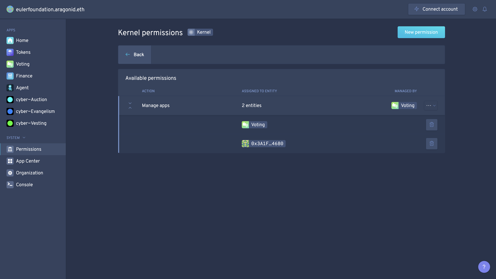

### Burn service's account token in Foundation DAO

Note: Service account complete his mission of Foundation setup and Auction and Vesting applications and permissions installation. Finalization of Auction setup will be be completed by Congress itself because Congress' Agent have needed direct permission (CREATOR_ROLE and BURNER_ROLE) on Foundation' Auction.

Remove tokens of service account:


Create transaction and proposal to remove 1 token from service account:


[Transaction details on removing 1 token from service account in Foundation](https://rinkeby.etherscan.io/tx/0xb8dd1b1eb573a9ca912849ab58847cf1096e10a950a85eaf2d791263e3c16ba2)

Created proposal to burn 1 token from service account in Foundation DAO:


Need to create proposal to vote YES on proposal to burn 1 token from service account in Foundation DAO in Congress DAO:
Command (cast tx):
```
dao act 0x988fbf6ee7219c0672351605ccc16060ed31d703 0x7c2e8bec18dbe0d0fb1ba2920824444c164aaf7f "vote(uint256,bool,bool)" 10 true true  --environment aragon:rinkeby --use-frame
```

Output:
```
  ⠙ Executing execute on 0xaAe1456bDEDaa40E2ecf20777Fab7Ec2f676477f
  ✔ Executing execute on 0xaAe1456bDEDaa40E2ecf20777Fab7Ec2f676477f

✔ Successfully executed: "Execute desired action as a token holder"
```

[Transaction details on creating proposal in Congress to vote on proposal to remove 1 token from service account in Foundation](https://rinkeby.etherscan.io/tx/0xe4b6e724f9536834fbb05ff619f06db21c346efac12bf6e465772f0f441ac649)

Created proposal in Congress DAO:


Passsed proposal in Congress DAO:


[Vote 1](https://rinkeby.etherscan.io/tx/0x069d0c7ed86846b765087b86b655cae7ed0d161fabb171eaf6cf1d05cb3026de) and 
[Vote 2](https://rinkeby.etherscan.io/tx/0xe7685fedd1ad6f2fffbc5999cbd6e4bd0acb4495630aaf1b4f99ec2c14be9861)

Passsed proposal for burn 1 token from service account in Foundation DAO:


Whole supply of Foundation DAO now follows distribution aggrement:
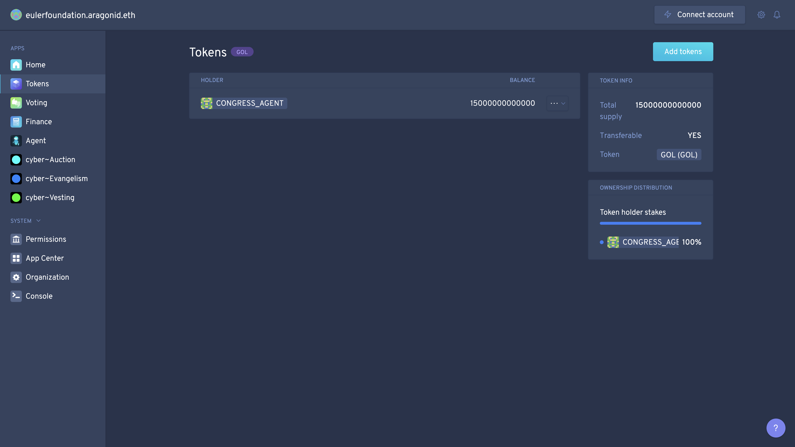

## Transfer tokens from Congress Agent to Auction contract

Now we can transfer needed amount of tokens to Auction for distribution following aggrement.
600 TGOL24 will be transffered from Congress' Agent to Foundation's Auction. Congress' Agent have permission for transfer their own token which we prepared before in Congress.

Command template (cast tx):
```
dao act <agentCongress> <agentCongress> "transfer(address,address,uint256)" <tokenFoundationAddress> <auctionApplicationAddress> <amount> --environment aragon:rinkeby
```
Command (cast tx):
```
dao act 0x988fbf6ee7219c0672351605ccc16060ed31d703 0x988fbf6ee7219c0672351605ccc16060ed31d703 "transfer(address,address,uint256)" 0xf6e8E6730d8E3F48519f150215013d654d43a53B 0xc13926630c1afa229a0c4df8df2acbff03c4681e 600000000000000  --environment aragon:rinkeby --use-frame
```
Output:
```
  ⠧ Executing execute on 0x9cE69C31F98827eE5B8602988E07F8A0Af787035
  ✔ Executing execute on 0x9cE69C31F98827eE5B8602988E07F8A0Af787035

✔ Successfully executed: "Execute desired action as a token holder"
```

[Transaction details of proposal to transfer congress agent foundation tokens to auction in foundation](https://rinkeby.etherscan.io/tx/0x85eba5c5e59babda59829b437fc782d724c1e85670716b48d1de753b89dee9be)

Created proposal to transfer supply from Congress' Agent to Auction in Congress DAO:


Passed proposal to transfer supply from Congress' Agent to Auction in Congress DAO:


[Vote 1](https://rinkeby.etherscan.io/tx/0x17e743014d548ccd5944a4199c3d3646607c40e1bc7db265b54e4cc06c1e2764) and 
[Vote 2](https://rinkeby.etherscan.io/tx/0x5224d0479557016e12694756b2c022a5e7952e622640680cba94bcc2042a9cbf)

Supply transffered to Auction in Foundation DAO:


Now Foundation disribution completed and Auction have supply for disribution. Congress, Investors and Inventors of Cyber may participated in Foundation governance with proportion of tokens which they have following aggrement and Cyber whitepaper.

## Load Auction

Last step with Auction setup. Supply already transffered and we may load Auction give amount of Auction tokens to be distributed during zero window (Ethereum part of Game of Thrones). Following aggrement there will be 200T TGOL24. The remaining amount will be equaly split for other rounds (20 rounds of 23 hours + 1 sec).

Note: Congress' Agent have permission to directly do this action on Foundtation' Auction as CREATOR_ROLE.

Command template (cast tx):
```
dao act <agentCongress> <auctionApplicationAddress> "load(uint256)" <amount> --environment aragon:rinkeby
```
Command (cast tx):
```
dao act 0x988fbf6ee7219c0672351605ccc16060ed31d703 0xc13926630c1afa229a0c4df8df2acbff03c4681e "load(uint256)" 200000000000000 --environment aragon:rinkeby --use-frame
```
Output:
```
  ⠸ Executing execute on 0xaAe1456bDEDaa40E2ecf20777Fab7Ec2f676477f
  ✔ Executing execute on 0xaAe1456bDEDaa40E2ecf20777Fab7Ec2f676477f

✔ Successfully executed: "Execute desired action as a token holder"
```

[Transaction details on load of auction by congress as creator of auction](https://rinkeby.etherscan.io/tx/0xc3af4f3039749c991d1b6c4888c063323103f0b2adcd03897d9a3f6430c8888e)

Created proposal to load Foundation's Auction in Congress DAO:


Passed proposal to load Foundation's Auction in Congress DAO:


[Vote 1](https://rinkeby.etherscan.io/tx/0x6424742be1dbe15f69b9e065ff209c120f18d997c2726ef11adb564f7cb76aa7) and 
[Vote 2](https://rinkeby.etherscan.io/tx/0xa61ee7e126d1d190027774f71c03fcedd76bae14b26e865262802ed3472e5d92)

## Deploy and verify Auction Utils

Extra step for Auction. We deploy additional contract which will provide robust API to query Auction data from Auction Contract. And after contract deploy we will add AuctionUtils contract address to Auction (which will provide point to access AuctionUtils from Auction). Cyber Page appilication use Auction Utils contract to provide stats of ongoing Auction (Aragon DApps by design uses event driven state processing and don't need this).

Code:
```
contract AuctionUtils {
    Auction public sale;

    constructor(Auction _sale) public {
        sale = _sale;
    }

    function dailyTotals() external view returns (uint[21] memory result) {
        for (uint i = 0; i < 21; i++) {
            result[i] = sale.dailyTotals(i);
        }
    }

    function userBuys(address user) external view returns (uint[21] memory result) {
        for (uint i = 0; i < 21; i++) {
            result[i] = sale.userBuys(i, user);
        }
    }

    function userClaims(address user) external view returns (bool[21] memory result) {
        for (uint i = 0; i < 21; i++) {
            result[i] = sale.claimed(i, user);
        }
    }
}
```

We will use Remix IDE for Auction Utils deployment:
Compiled Auction Utils in Remix IDE:


Deploy of Auction Utils:


[Transaction details on AuctionUtils deployment](https://rinkeby.etherscan.io/tx/0xe6da431baf335059e3e4847aebcad8045267dbcb297f4d78e570b90247ff7d3d)

Auction Utils deployed with initialized Auction address:
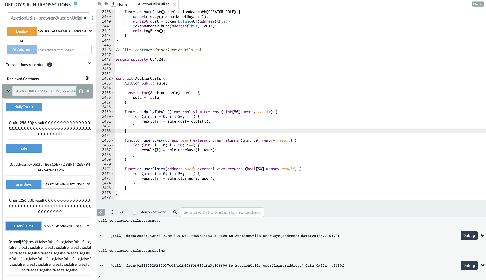

Auction Utils contract [0x5a9db7080db6c5b176795910343a74797dea1124](https://rinkeby.etherscan.io/address/0x5a9db7080db6c5b176795910343a74797dea1124)

Let's verify contract. We will use single file provided by truffle-flattener. Compiler v0.4.24+commit.e67f0147 without optimization.

Prepare source code for verification on Etherscan:


Verification on Etherscan passed:


Verified contract:


## Add Auction Utils address to Auction
Now we add Auction Utils address to Auction. Agent have direct access with CREATOR_ROLE on Foundation' Auction, proposal for Agent's action will be created in Congress only.
Command template (cast tx):
```
dao act <agentCongress> <auctionApplicationAddress> "addUtils(address)" <auctionUtilsAddress> --environment aragon:rinkeby
```
```
dao act 0x988fbf6ee7219c0672351605ccc16060ed31d703 0xc13926630c1afa229a0c4df8df2acbff03c4681e "addUtils(address)" 0x5a9db7080db6c5b176795910343a74797dea1124 --environment aragon:rinkeby --use-frame
```
Output:
```
  ⠼ Executing execute on 0xaAe1456bDEDaa40E2ecf20777Fab7Ec2f676477f
  ✔ Executing execute on 0xaAe1456bDEDaa40E2ecf20777Fab7Ec2f676477f

✔ Successfully executed: "Execute desired action as a token holder"
```

[Transaction details on creating proposal in Congress to add Auction Utils address to Auction in Foundation](https://rinkeby.etherscan.io/tx/0x55aa09da12abc9130b5321af668a5d81825c276ac8d6328018c4755867b29871)

Proposal to add Auction Utils contract address to Foundation's Auction on Congress DAO:


Passed droposal to add Auction Utils contract address to Foundation's Auction on Congress DAO:
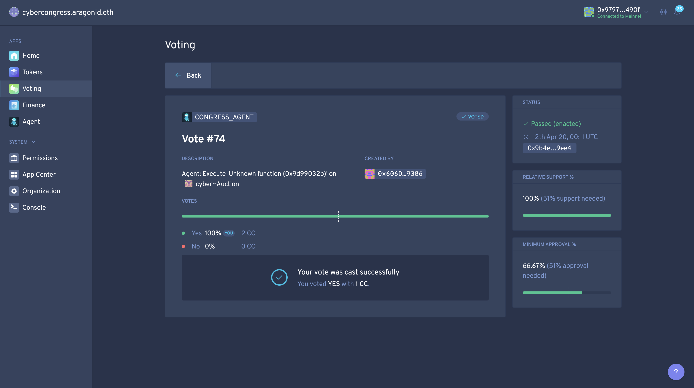

[Vote 1](https://rinkeby.etherscan.io/tx/0xe9a669c63faa8e27e7935293d1307df76bedff8093bd434a511c59768afeace7) and 
[Vote 2](https://rinkeby.etherscan.io/tx/0x186fcbe03dda529336d8d296d8e676d6c55cd673ae9a6f3622f4131abf6f33b0)

## 7. Distribute tokens

Now Congress may finish distribution process and transfer tokens to invertors and investors of Cyber. The remaining amount of tokens - is Congress share following distribution and Cyber whitepaper.

Command template (cast tx):
```
dao act <agentCongress> <agentCongress> "transfer(address,address,uint256)" <tokenFoundationAddress> <accountTo> <amountTokens> --environment aragon:rinkeby
```

### Inventors
Command (cast tx):
```
dao act 0x988fbf6ee7219c0672351605ccc16060ed31d703 0x988fbf6ee7219c0672351605ccc16060ed31d703 "transfer(address,address,uint256)" 0xf6e8E6730d8E3F48519f150215013d654d43a53B 0xC41394F95FDd40193a2bf7Cb035f800CE1Edd908 10000000000000  --environment aragon:rinkeby --use-frame
```
Output:
```
  ⠸ Executing execute on 0xaAe1456bDEDaa40E2ecf20777Fab7Ec2f676477f
  ✔ Executing execute on 0xaAe1456bDEDaa40E2ecf20777Fab7Ec2f676477f

✔ Successfully executed: "Execute desired action as a token holder"
```

[Transaction details on transfer tokens to invertor 1](https://rinkeby.etherscan.io/tx/0xb941d08e1905f86f12387b192862d2d0000c978ba57bcf87f192977a0d2e7457)

Command (cast tx):
```
dao act 0x988fbf6ee7219c0672351605ccc16060ed31d703 0x988fbf6ee7219c0672351605ccc16060ed31d703 "transfer(address,address,uint256)" 0xf6e8E6730d8E3F48519f150215013d654d43a53B 0x47452dd11238f8db91e42d0b579d3fFF046Af499 10000000000000  --environment aragon:rinkeby --use-frame
```
Output:
```
  ⠸ Executing execute on 0xaAe1456bDEDaa40E2ecf20777Fab7Ec2f676477f
  ✔ Executing execute on 0xaAe1456bDEDaa40E2ecf20777Fab7Ec2f676477f

✔ Successfully executed: "Execute desired action as a token holder"
```

[Transaction details on transfer tokens to invertor 2](https://rinkeby.etherscan.io/tx/0xc06a338aaffad697a139cc0c047dae4cfd067d3ad1b6cd0d1623b554e3122a8b)

Congressman votes on transfer proposals in Congress DAO:
Congressmans votes for transfers:


[Vote 1](https://rinkeby.etherscan.io/tx/0x26d00a6d8b183bf09d2223fffe547a722d2044f236f04157dcc81d4c5a785855) and 
[Vote 2](https://rinkeby.etherscan.io/tx/0x5663a6d565c0f540ae40c3a2a537e400ccc2b574388304e28060f692b94d95b4)


[Vote 1](https://rinkeby.etherscan.io/tx/0x1993c8ac94c122b41862e891528e5df0fc5528f7e849df45a5761c5817ce5be9) and 
[Vote 2](https://rinkeby.etherscan.io/tx/0xcb6d97120b04eb3c8aedcbac1223ffc9ee8e564a8209e79ad6375869a48ac754)

Foundation DAO, inventors got their tokens:


### Investors
```
in mainnet
```

## Final state

### Foundation DAO
1. Foundation deployed by cyber~Congress Aragon DAO via Agent.
2. Foundation Aragon DAO name is TGOL26
3. Supply of TGOL26 is 700000000000000
4. Installed and prepared Auction Aragon application developed by cyber~Congress
5. Installed and prepared Vesting Aragon application developed by cyber~Congress
6. Permission's mananger on issue tokens on Token Manager set to Foundation's Voting application
7. Permission's mananger on assign tokens on Token Manager set to Foundation's Voting application
8. Congress Agent have permission to manage apps on Kernel in reason to proccess application upgrades in case of bugs


### Vesting application
1. Vesting end set to Wednesday, April 1, 2020 1:00:00 AM GMT (1585702800)
2. Vesting application PAUSE_ROLE set to Congress Agent, role manager is Congress Agent
3. Vesting application PROOF_ROLE set to Congress Vesting Companion Proofer external address, role manager in Congress Agent
4. Vesting app have permission to issue tokens on Foundation's Token Manager
5. Vesting app have permission to assign tokens on Foundation's Token Manager
6. Vesting app have permission to burn tokens on Foundation's Token Manager

### Auction application
1. Auction zero round (Ethereum's Game of Thrones) set to 1585245600 Thursday, March 26, 2020 6:00:00 PM GMT
2. Auction rounds starts in 1585591200 Monday, March 30, 2020 6:00:00 PM GMT
3. Anount of rounds 20+1(zero window)
4. Duration of round is 23 hours + 1 sec
5. Collector of funds is Foundation DAO (Foundation's Agent address)
6. Vesting app have permission to burn tokens on Foundation's Token Manager
7. Auction application CREATOR_ROLE set to Congress Agent, role manager is Congress Agent
7. Auction application BURNER_ROLE set to Congress Agent, role manager is Congress Agent


### Total transactions
70 transactions

Note: includes only Foundation setup and distribution (not Congress Agent preparation and applications publishing in APM)

### Total burned gas
28,377,834 (with 10Gwei gas price it's 0.2838 ETH)

Note: includes only Foundation setup and distribution (not Congress Agent preparation and applications publishing in APM)

## Final thoughts
1. Aragon is an amazing project with endless features for DAOs creation and their operations.
2. Use your own node, not infura. It's boosts process 10x.
3. Prepare yourself for this process. Take a rest before. You should be fully concetrated because there is no room for error
4. TODO

## TODO in next doc iteration
5. Verify Auction/Vesting applications on Etherscan
14. Check investing from agent and claiming from agent e.g contract
15. Add congress' account to manager of APM
