# euler~Foundation Aragon Ceremony

## TL:DR
The guide will walk you through the setup process of an Aragon-based DAO, by another existing Aragon DAO, using the setup process of cyber~Foundation, the community governing DAO behind [cyber](https://cyber.page/). As a result, you will setup a decentralized community-governed DAO, that can distribute shares to its holders via the use of 2 apps, the vesting and the auction app. 

### Content
- [Introduction](https://github.com/litvintech/foundation-ceremony/blob/5128ad34a8d0135597f6a3a071edd5e19f180f7c/foundation.md#introduction)
  * [What for and for whom is this guide?](https://github.com/litvintech/foundation-ceremony/blob/5128ad34a8d0135597f6a3a071edd5e19f180f7c/foundation.md#what-for-and-for-whom-is-this-guide)
  * [About euler&cyber~Foundation(s)](https://github.com/litvintech/foundation-ceremony/blob/5128ad34a8d0135597f6a3a071edd5e19f180f7c/foundation.md#about-eulercyberfoundations)
  * [Process flow](https://github.com/litvintech/foundation-ceremony/blob/5128ad34a8d0135597f6a3a071edd5e19f180f7c/foundation.md#process-flow)
  * [The process in numbers](https://github.com/litvintech/foundation-ceremony/blob/5128ad34a8d0135597f6a3a071edd5e19f180f7c/foundation.md#the-process-in-numbers)
  * [Prepare your setup background](https://github.com/litvintech/foundation-ceremony/blob/5128ad34a8d0135597f6a3a071edd5e19f180f7c/foundation.md#prepare-your-setup-background)
-------------------------------------------------------
- [cyber~Congress DAO](https://github.com/litvintech/foundation-ceremony/blob/5128ad34a8d0135597f6a3a071edd5e19f180f7c/foundation.md#cybercongress-dao)
  * [Configuration](https://github.com/litvintech/foundation-ceremony/blob/5128ad34a8d0135597f6a3a071edd5e19f180f7c/foundation.md#configuration)
  * [The process](https://github.com/litvintech/foundation-ceremony/blob/5128ad34a8d0135597f6a3a071edd5e19f180f7c/foundation.md#the-process)
  * [Agent](https://github.com/litvintech/foundation-ceremony/blob/5128ad34a8d0135597f6a3a071edd5e19f180f7c/foundation.md#agent)
  * [Grant Permission to Agent to transfer their own tokens](https://github.com/litvintech/foundation-ceremony/blob/5128ad34a8d0135597f6a3a071edd5e19f180f7c/foundation.md#grant-permission-to-agent-to-transfer-their-own-tokens)
---------------------------
- [Deploy Aragon Company Template](https://github.com/litvintech/foundation-ceremony/blob/5128ad34a8d0135597f6a3a071edd5e19f180f7c/foundation.md#deploy-aragon-company-template)
  * [Changes](https://github.com/litvintech/foundation-ceremony/blob/5128ad34a8d0135597f6a3a071edd5e19f180f7c/foundation.md#changes)
  * [Deploy](https://github.com/litvintech/foundation-ceremony/blob/5128ad34a8d0135597f6a3a071edd5e19f180f7c/foundation.md#deploy)
  * [Verify on Etherscan](https://github.com/litvintech/foundation-ceremony/blob/5128ad34a8d0135597f6a3a071edd5e19f180f7c/foundation.md#verify-on-etherscan)
---------------------------------- 
- [Vesting & Auction Aragon applications](https://github.com/litvintech/foundation-ceremony/blob/5128ad34a8d0135597f6a3a071edd5e19f180f7c/foundation.md#vesting--auction-aragon-applications)
  * [Vesting application](https://github.com/litvintech/foundation-ceremony/blob/5128ad34a8d0135597f6a3a071edd5e19f180f7c/foundation.md#vesting-application)
  * [Auction application](https://github.com/litvintech/foundation-ceremony/blob/5128ad34a8d0135597f6a3a071edd5e19f180f7c/foundation.md#auction-application)
  * [Deploy to Aragon Package Manager (APM)](https://github.com/litvintech/foundation-ceremony/blob/5128ad34a8d0135597f6a3a071edd5e19f180f7c/foundation.md#deploy-to-aragon-package-manager-apm)
  * [Propagate application to IPFS](https://github.com/litvintech/foundation-ceremony/blob/5128ad34a8d0135597f6a3a071edd5e19f180f7c/foundation.md#propagate-application-to-ipfs)
------------------------------------- 
- [Cyber Foundation DAO](https://github.com/litvintech/foundation-ceremony/blob/5128ad34a8d0135597f6a3a071edd5e19f180f7c/foundation.md#cyber-foundation-dao)
  * [Create a proposal to deploy a token by the Congress Agent](https://github.com/litvintech/foundation-ceremony/blob/5128ad34a8d0135597f6a3a071edd5e19f180f7c/foundation.md#create-a-proposal-to-deploy-a-token-by-the-congress-agent)
  * [Create a proposal to deploy the DAO by the Congress Agent](https://github.com/litvintech/foundation-ceremony/blob/5128ad34a8d0135597f6a3a071edd5e19f180f7c/foundation.md#create-a-proposal-to-deploy-the-dao-by-the-congress-agent)
  * [Vote for token and DAO deployment by Cyber Congressmen](https://github.com/litvintech/foundation-ceremony/blob/5128ad34a8d0135597f6a3a071edd5e19f180f7c/foundation.md#vote-for-token-and-dao-deployment-by-cyber-congressmen)
  * [Votes for foundation deployemnt]()https://github.com/litvintech/foundation-ceremony/blob/5128ad34a8d0135597f6a3a071edd5e19f180f7c/foundation.md#votes-for-foundation-deployemnt
  * [Check the Foundation DAO](https://github.com/litvintech/foundation-ceremony/blob/5128ad34a8d0135597f6a3a071edd5e19f180f7c/foundation.md#check-the-foundation-dao)
  * [Voting by the Congress Agent in the Foundation](https://github.com/litvintech/foundation-ceremony/blob/5128ad34a8d0135597f6a3a071edd5e19f180f7c/foundation.md#voting-by-the-congress-agent-in-the-foundation)
----------------------------------------- 
- [Install the Vesting application for the Foundation DAO](https://github.com/litvintech/foundation-ceremony/blob/5128ad34a8d0135597f6a3a071edd5e19f180f7c/foundation.md#install-the-vesting-application-for-the-foundation-dao)
  * [Parameters](https://github.com/litvintech/foundation-ceremony/blob/5128ad34a8d0135597f6a3a071edd5e19f180f7c/foundation.md#parameters)
  * [Install the application](https://github.com/litvintech/foundation-ceremony/blob/5128ad34a8d0135597f6a3a071edd5e19f180f7c/foundation.md#install-the-application)
  * [Initialize Proof/Pause Roles](https://github.com/litvintech/foundation-ceremony/blob/5128ad34a8d0135597f6a3a071edd5e19f180f7c/foundation.md#initialize-proofpause-roles)
  * [Grant permission to Issue/Assign/Burn as Token Manager](https://github.com/litvintech/foundation-ceremony/blob/5128ad34a8d0135597f6a3a071edd5e19f180f7c/foundation.md#grant-permission-to-issueassignburn-as-token-manager)
-------------------------------------------- 
- [Installing the Auction application for the Foundation DAO](https://github.com/litvintech/foundation-ceremony/blob/5128ad34a8d0135597f6a3a071edd5e19f180f7c/foundation.md#installing-the-auction-application-for-the-foundation-dao)
  * [Parameters](https://github.com/litvintech/foundation-ceremony/blob/5128ad34a8d0135597f6a3a071edd5e19f180f7c/foundation.md#parameters-1)
  * [Install](https://github.com/litvintech/foundation-ceremony/blob/5128ad34a8d0135597f6a3a071edd5e19f180f7c/foundation.md#install)
  * [Initialize the Creator Role](https://github.com/litvintech/foundation-ceremony/blob/5128ad34a8d0135597f6a3a071edd5e19f180f7c/foundation.md#initialize-the-creator-role)
  * [Grant permission for Burn rights as Token Manager](https://github.com/litvintech/foundation-ceremony/blob/5128ad34a8d0135597f6a3a071edd5e19f180f7c/foundation.md#grant-permission-for-burn-rights-as-token-manager)
  * [Set the congress agent as app manager in the Foundation DAO](https://github.com/litvintech/foundation-ceremony/blob/5128ad34a8d0135597f6a3a071edd5e19f180f7c/foundation.md#set-the-congress-agent-as-app-manager-in-the-foundation-dao)
  * [Burn service account token in the Foundation DAO](https://github.com/litvintech/foundation-ceremony/blob/5128ad34a8d0135597f6a3a071edd5e19f180f7c/foundation.md#burn-service-account-token-in-the-foundation-dao)
  * [Transfer tokens from the Congress Agent to the Auction contract](https://github.com/litvintech/foundation-ceremony/blob/5128ad34a8d0135597f6a3a071edd5e19f180f7c/foundation.md#transfer-tokens-from-the-congress-agent-to-the-auction-contract)
  * [Load the Auction](https://github.com/litvintech/foundation-ceremony/blob/5128ad34a8d0135597f6a3a071edd5e19f180f7c/foundation.md#load-the-auction)
  * [Deploy and verify `AuctionUtils`](https://github.com/litvintech/foundation-ceremony/blob/5128ad34a8d0135597f6a3a071edd5e19f180f7c/foundation.md#deploy-and-verify-auction-utils)
  * [Add `AuctionUtils` address to the Auction](https://github.com/litvintech/foundation-ceremony/blob/5128ad34a8d0135597f6a3a071edd5e19f180f7c/foundation.md#add-auctionutils-address-to-the-auction)
--------------------------- 
- [Distribute tokens](https://github.com/litvintech/foundation-ceremony/blob/5128ad34a8d0135597f6a3a071edd5e19f180f7c/foundation.md#distribute-tokens)
  * [Inventors](https://github.com/litvintech/foundation-ceremony/blob/5128ad34a8d0135597f6a3a071edd5e19f180f7c/foundation.md#inventors)
  * [Initial donors](https://github.com/litvintech/foundation-ceremony/blob/bcd079909c1e6a739cc8dec0b51b56802e1c1735/foundation.md#initial-donors)
------------------------------- 
- [Final state](https://github.com/litvintech/foundation-ceremony/blob/5128ad34a8d0135597f6a3a071edd5e19f180f7c/foundation.md#final-state)
  * [Foundation DAO](https://github.com/litvintech/foundation-ceremony/blob/5128ad34a8d0135597f6a3a071edd5e19f180f7c/foundation.md#foundation-dao)
  * [Vesting application](https://github.com/litvintech/foundation-ceremony/blob/5128ad34a8d0135597f6a3a071edd5e19f180f7c/foundation.md#vesting-application-1)
  * [Auction application](https://github.com/litvintech/foundation-ceremony/blob/5128ad34a8d0135597f6a3a071edd5e19f180f7c/foundation.md#auction-application-1)
  * [Final thoughts](https://github.com/litvintech/foundation-ceremony/blob/5128ad34a8d0135597f6a3a071edd5e19f180f7c/foundation.md#final-thoughts)
--------------------------------

### Introduction
cyber is a decentralized google. Its mission is to decentralize the services and the infrastructure of the internet via the use of blockchain technology and cyberlinks. In other words, cyber is an innovative search protocol. Such a protocol should not be owed by one company, but rather be governed by its stakeholders, that can decide on its development via simple governance mechanisms. The current guide covers the particular case of setting up euler~Foundation. You may substitute the word `euler` to use it as a workflow guide for your own setup.

We are really concerned about following the principles of decentralization and believe that DAOs are the way to achieve it. We use Aragon bread DAOs for governance within our project. 

If we think about DAO from a technical perspective we see smart contracts and accounts as technical tools to create the DAO. The account that creates the DAO gets extra power and is not fully compliant with trustless principles. 
 
It’s obvious that a limited number of people can start a DAO, but put into consideration, decentralization is the main principle of our project and this situation should be changed. Another important point is the take-off of the project. It’s not a moment, it is a time-consuming process. Both points bring us to the realization of the `point zero` problem.
 
To overcome this restriction we create a two-level structure. The zero-level here is the cyber~Congress DAO and the first-level is the cyber ~Foundation DAO. The Foundation DAO is an entity created to manage and develop the Cyber project. The Congress DAO is an organization with one simple aim - to launch the project itself and to work on it as one of the shareholders, including the setup of the Foundation DAO. 
 
Detailed information about the tasks of both DAOs can be found in either our [WP](https://ipfs.io/ipfs/QmceNpj6HfS81PcCaQXrFMQf7LR5FTLkdG9sbSRNy3UXoZ)or our [homestead documentation](https://github.com/cybercongress/congress/blob/master/ecosystem/Cyber%20Homestead%20doc.md).

#### What for and for whom is this guide?
1. For Cyber community, for whom we provide a fully transparent workflow 
2. As part of the documentation of the work of cyber~Congress 
3. For open-source Aragon developers who are trying to find answers to their questions about DAO setup
4. For Aragon community, that wishes to discover the endless possibilities of the Aragon project
5. For anyone wishing to set up a DAO in a decentralized manner

#### About euler&cyber~Foundation(s)
- euler~Foundation: is the testing of cyber ~Foundation. It is deployed to ETH's mainnet during GoL (gamified part of cybers distribution process). Its main purpose is to test everything before the launch of the mainnet  
- cyber~Foundation: is the community governing DAO behind cyber. It will consist of stakeholders that wish to be part of the governing process. cyber ~Foundation, apart from everything, will be in charge of the ETH pot donated to the foundation during cyber ~Auction (part of cybers distribution process). Making it is a fully Decentralized Autonomous Organisation in charge of its own funding

#### Process flow
0. Prepare your setup
1. Cyber Congress DAO
    1. Configuration
    2. Agent
    3. Grant Permission to transfer Agent their own tokens
2. Deploy Aragon Company Template
    1. Changes
    2. Deployment
    3. Verification
3. Vesting & Auction Aragon applications
    1. About Vesting application
    2. About Auction application
    3. Deploy to Aragon Package Manager (APM)
    4. Propagate application to IPFS
4. Cyber Foundation DAO
    1. Create a proposal to deploy a token by the Congress Agent
    2. Create a proposal to deploy DAO by the Congress Agent
    3. Vote for token and DAO deployment by Cyber Congress
    4. Check Foundation DAO
    5. Voting by the Congress Agent in Foundation DAO
5. Install Vesting application to Foundation
    1. Parameters
    2. Install application
    3. Initialize Proof/Pause Roles
    4. Grant permissions to Issue/Assign/Burn as Token Manager
6. Install the Auction application to Foundation DAO
    1. Parameters
    2. Install
    3. Initialize Creator Role
    4. Initialize Burner Role
    5. Grant permission for burning to Token Manager
    6. Set the Congress Agent as a manager in the kernel's app Foundation
    7. Burn the service account token in the Foundation DAO
    8. Transfer tokens from the Congress Agent to the Auction contract
    9. Load Auction
    10. Deploy and verify AuctionUtils
    11. Add AuctionUtils address to the Auction
7. Distribute tokens
    1. Inventors
    2. Initial donors
8. Final State
    1. Foundation DAO
    2. Vesting application
    3. Auction application
9. Final thoughts

#### The process in numbers
*Total transactions:*
70 transactions

*Total gas burned:* 
28,377,834 (with the price of gas equals to 10Gwei, this accounts for 0.2838 ETH)

*Note:* this only includes the setup of the Foundation and the distribution (does not include the preparation of the Congress Agent and publishing the applications in APM)

#### Prepare your setup background
- Recommended NodeJS v.10.18.0
- Recommended Aragon / CLI v.7.0.3/6.4.4
- A local IPFS node and a dedicated IPFS cluster (for propagating the content of the application)
- A local or a dedicated Ethereum node (for faster operations)
- We recommend using [Frame](https://frame.sh/) for operations (for a smoother process)
- Check the [troubleshooting and FAQ](https://hack.aragon.org/docs/guides-faq) guide

_________

### [cyber~Congress DAO](https://rinkeby.aragon.org/#/cc16)

#### Configuration
The cyber~Congress DAO is an Aragon-based DAO, bootstrapped using the official [membership Aragon template](https://github.com/aragon/dao-templates/tree/master/templates/membership) with an installed Agent. It uses a non-transferable token to represent membership. Decisions are made based on one-member-one-vote governance.

*Signers:*
- 0x47452dd11238f8db91e42d0b579d3fFF046Af499
- 0xC41394F95FDd40193a2bf7Cb035f800CE1Edd908
- 0xAc75629E936d6611F8f06d821cd26cCAEE9d43b8

*Voting parameters:*
- Support: 51%
- Approval: 51%
- Voting Duration: 7 days

*Token:*
cyber~Congressman (CC)

*Offical Documentation:*
- [Official User Guide of Membership Organization](help.aragon.org/article/34-create-a-new-membership-organization)
- [Source Code on GitHub](https://github.com/aragon/dao-templates/tree/templates-membership-v1.0.0/templates/membership)

#### The process
The whole process of the setup is fairly simple and can be outlined by the following:
-  Setup a DAO and an agent
- Set correct permissions and rights
- Install the required apps and rights
- Distribute tokens to addresses 

But, this requires a step by step setup with explanations and guidance, described below.

#### Agent
The Agent app (or Aragon Agent) is an Aragon app that can be installed in any Aragon DAO. Its main feature is its ability to perform arbitrary calls to contracts. This means it can be thought of as the external interface of a DAO. In other words, it is a multi-signature ETH account owed by the DAO and represents the will of its shareholders. It allows the DAO to interact with contracts, manage names, buy digital land, make transactions, etc, without having to implement a custom application for each use case. 


We strongly recommend to read Aragons agent guide: [How to use an Aragon Agent](https://hack.aragon.org/docs/guides-use-agent)

### Grant Permission to Agent to transfer their own tokens
We need to grant access to the Agent to transfer tokens from their own account. This is because during the setup of the Foundation DAO we will issue the whole initial supply to the DAO. Essentially, this means that the actors behind the initiation of the Congress DAO will govern the setup process of the Foundation DAO. 

Following the bootstrap process, the tokens from the agent will be transferred to the auction and then will be distributed to donors and inventors. The donors that vest and participate in the auction need to be able to transfer these tokens onwards. This means, that the Agent needs permission for transfers, that is not `on` by default.

Part of the donors will also continue to hold the tokens following the distribution process. 

All of this requires us to create a new proposal from the permisisons tab of the Congress DAO and vote for it. After the voting is over, go to the permissions tab and makes sure that in the Agents permisisons tab, under `Transfer Agent’s tokens` a new entity (the Agent) appears:


_________

### Deploy Aragon Company Template
cyber~Foundation will be a DAO, which is based on the [Company Aragon DAO Template](https://github.com/aragon/dao-templates/tree/master/templates/company). It will use transferable tokens to represent stake ownership in the DAO. Decisions are made based on stake-weighted voting.

We are going to deploy a custom template because within cyber tokens don't have decimals. This means that during the vesting and claim processes between the Foundation DAO and Cyber (euler or cyber) we need to operate with zero decimals tokens. By default, organisations come with a token that is divisible by 18 decimal points (like most ERC-20 tokens). 

We strongly recommend reading this guide from Aragon on [using company templates for DAO setup](https://help.aragon.org/article/30-create-a-new-company-organization).

#### Changes
Because we need a token with __zero decimals__. We are going to take a typical template and modify the necessary info to change the 18 to 0:

1. Clone the official Aragon DAO-Template [repository](https://github.com/aragon/dao-templates/):

```
git clone https://github.com/aragon/dao-templates
cd dao-templates/templates/company
```

2. Change [one line](https://github.com/aragon/dao-templates/blob/master/templates/company/contracts/CompanyTemplate.sol#L14) and set TOKEN_DECIMALS to 0:

```
uint8 constant private TOKEN_DECIMALS = uint8(0);
```

Diff of CompanyTemplate.sol:

```
--- a/templates/company/contracts/CompanyTemplate.sol
+++ b/templates/company/contracts/CompanyTemplate.sol
@@ -11,7 +11,7 @@ contract CompanyTemplate is BaseTemplate, TokenCache {
     string constant private ERROR_BAD_PAYROLL_SETTINGS = "COMPANY_BAD_PAYROLL_SETTINGS";

     bool constant private TOKEN_TRANSFERABLE = true;
-    uint8 constant private TOKEN_DECIMALS = uint8(18);
+    uint8 constant private TOKEN_DECIMALS = uint8(0);
     uint256 constant private TOKEN_MAX_PER_ACCOUNT = uint256(0);
     uint64 constant private DEFAULT_FINANCE_PERIOD = uint64(30 days);

@@ -30,7 +30,7 @@ contract CompanyTemplate is BaseTemplate, TokenCache {
     * @param _tokenSymbol String with the symbol for the token used by share holders in the organization
     * @param _id String with the name for org, will assign `[id].aragonid.eth`
     * @param _holders Array of token holder addresses
-    * @param _stakes Array of token stakes for holders (token has 18 decimals, multiply token amount `* 10^18`)
+    * @param _stakes Array of token stakes for holders (token has 0 decimals)
     * @param _votingSettings Array of [supportRequired, minAcceptanceQuorum, voteDuration] to set up the voting app of the organization
     * @param _financePeriod Initial duration for accounting periods, it can be set to zero in order to use the default of 30 days.
     * @param _useAgentAsVault Boolean to tell whether to use an Agent app as a more advanced form of Vault app
@@ -66,7 +66,7 @@ contract CompanyTemplate is BaseTemplate, TokenCache {
     * @dev Deploy a Company DAO using a previously cached MiniMe token
     * @param _id String with the name for org, will assign `[id].aragonid.eth`
     * @param _holders Array of token holder addresses
-    * @param _stakes Array of token stakes for holders (token has 18 decimals, multiply token amount `* 10^18`)
+    * @param _stakes Array of token stakes for holders (token has 0 decimals)
     * @param _votingSettings Array of [supportRequired, minAcceptanceQuorum, voteDuration] to set up the voting app of the organization
     * @param _financePeriod Initial duration for accounting periods, it can be set to zero in order to use the default of 30 days.
     * @param _useAgentAsVault Boolean to tell whether to use an Agent app as a more advanced form of Vault app
@@ -95,7 +95,7 @@ contract CompanyTemplate is BaseTemplate, TokenCache {
     * @dev Deploy a Company DAO using a previously cached MiniMe token
     * @param _id String with the name for org, will assign `[id].aragonid.eth`
     * @param _holders Array of token holder addresses
-    * @param _stakes Array of token stakes for holders (token has 18 decimals, multiply token amount `* 10^18`)
+    * @param _stakes Array of token stakes for holders (token has 0 decimals)
     * @param _votingSettings Array of [supportRequired, minAcceptanceQuorum, voteDuration] to set up the voting app of the organization
     * @param _financePeriod Initial duration for accounting periods, it can be set to zero in order to use the default of 30 days.
     * @param _useAgentAsVault Boolean to tell whether to use an Agent app as a more advanced form of Vault app
```

#### Deploy
Command (cast tx):

```
npm run deploy:<network>
```

Output:

```
=========
# CompanyTemplate:
Address: 0x47a5f974312b254395d329d6de5b264e0579bbb1
Transaction hash: 0x7286d11d2276268c24b620f245b78e0e1c2bebe3d82e83ab55d6d1386684fb29
Compiler: solc@0.4.24+commit.e67f0147.Emscripten.clang (Optimizer: 10000 runs)
Compiled at: 2020-01-19T11:38:01.984Z
=========
```

#### Verify on Etherscan
Using [ethscan](https://etherscan.io/), make sure that your code is good to go. Prepare a single file with the required code for verification:

```
truffle-flattener CompanyTemplate.sol > CompanyTemplateFull.sol
```

And then, use Etherscan Verification service to verify the contract. Set optimization to enabled with __10000 runs__.

Link to a verified template [contract](https://rinkeby.etherscan.io/address/0x47a5f974312b254395d329d6de5b264e0579bbb1#code) on Etherscan

__________

### Vesting & Auction Aragon applications
The vesting and the Auction applications are created and used by cyber as part of its distribution process. You are welcome to clone the repositories and use the applications for your own needs:

Repositories:
- [Vesting application](https://github.com/cybercongress/aragon-vesting-app)
- [Auction application](https://github.com/cybercongress/aragon-auction-app)

#### Vesting application
The Vesting app is used to vest your cyber~Foundation tokens (GOL, THC)  until the end of cyber ~Auction. It is also used to claim an equivalent, 1-to-1, amount of tokens in the Cyber blockchain (if the Foundation tokens are vested).

GOL tokens are the testing equivalent of THC. THC is the main governing token of cyber. THC is an ERC-20 token and lives in the Ehereum mainnet. 

Your tokens will be locked for transfer for the duration of the auction. But, are available to be used for participating in the governance of the DAO. The auction is part of cybers distribution process, where for a period of a certain time, donors that wish to become stakeholders in the governance of cyber, donate ETH to cyber~Fundation, the community governed DAO. You are welcome to read and explore more information about cyber ~Autcion [here](https://github.com/cybercongress/congress/blob/master/ecosystem/Cyber%20Homestead%20doc.md#cyberauction-or-auction).

After the end of the auction and the finalization of the distribution, the tokens will be unlocked for transfer. From this point onwards, cyber~Congress will no longer be responsible for their transfer.

If you don't vest your tokens during the auction, they will become available for transfers, and for example, for trading on Uniswap or OTC. In both cases, the value of the Foundation tokens is determined by market demand and comes from the ability to participate in the governance of the Foundation and from their ability to claim CYB tokens (cybers mainnet tokens) on 1-1 basis (if vested!). If you transfer non-vested tokens to another account, you are also transferring vesting rights. Each token can only be vested once! 

It should be noted that the vesting companion will be turned off for everyone at the same time. This will also impose the burning of the unclaimed CYB tokens. Users who participate at the end of the auction will face a larger inflation washdown of their share, as there will be more tokens available on the market for the same price.  

The vesting can be stopped by the Congress Agent at any time due to activation of a crisis protocol (for example, a hack of the hot wallet).

Features:
- Vest and lock user tokens for transfers, until a set date
- Claim creation
- Process user claims state

Under the hood, we need proof that the tokens go to the desired destination. The flow is fairly simple: 
- The companion is a program that knows for which events to look out for
-  It is a daemon with a cyber key and an ETH key that can add proofs and send transactions 
- It can also make proofs about these transfers and claim vesting 
- A hot wallet tracks claim events
- It sends tokens to a cyber address
- It then takes the hash of a successful transfer, which you can see it the app

[Vesting contract exmaple](https://github.com/cybercongress/aragon-vesting-app/blob/master/contracts/Vesting.sol)

#### Auction application
By using the Auction application, users may acquire tokens that are allocated for distribution within the Foundation.

The auction consists of rounds. A so-called `zero` window, which is longer than the other windows and with more tokens for distribution. The subsequent rounds (windows) have equal length and an equal amount of tokens for distribution. This is done purely for traction and allows certain economic mechanisms to work to their full efficiency.

Donors may send ETH to the auction and choose the round or the rounds they want to participate in beforehand. They may also send ETH on each round separately. The actioned tokens will become available for transfer after a given round has passed. I.E. if I send ETH to window 5 of the auction, my THC will become available for transfer (and hence, vesting) after window 5 is over. 

Each round a certain amount of THC tokens is auctioned. The amount of THC the donors receive is proportional to the donated amount in that round. I.E. if 10 tokens are available for auction at round 5, and 10 ETH from 10 people were donated, each person will receive 1 token after the end of the round. 

Window 0 or Game of Thrones is a 21-day round in the mainnet. During testing, the round will last for 10 days. Subsequent rounds of the auction, in both testnets and mainnet, will last for 23 hours + 1 hour for calculation. Overall, there are 479 rounds in the mainnet (and 20 fo the testing). Which totals to just over 500 days of the auction with round 0 in the mainnet. We strongly recommend reading more information about the auction and the distribution games [here](https://github.com/cybercongress/congress/blob/master/ecosystem/Cyber%20Homestead%20doc.md#the-distribution-games-in-detail).

The accumulated ETH is available for transfer at any time to the Foundations DAO agent by any participant of the auction (not a front end function for now). Of course, from this point onwards, those ETH’s are controlled via the governance mechanisms of cyber~Foundation.

Features:
- Buy tokens
- Claim tokens
- Collect ETH for foundation

If someone acquired THC tokens during the auction but didn't claim them after some time had passed, those THC tokens will be **send to the balance of the agent and controlled via governance**.

Under the hood the process is also fairly simple:
- The auction has a start time and
- An open time. What happens in between is called round 0
- There are 2 actions, that allow users to either acquire on a certain round for a certain amount of ETH
- And claim after a certain round has finished and the price has been calculated
- After the claim, the user may use the vesting app to vest the received THC until the end of the auction and receive CYB. They may also transfer their THC and use them

The Agent can initialize the auction and stop it. The app needs permissions to interact with other apps.

#### Deploy to Aragon Package Manager (APM)
APM is a DAO that can deploy packets. It has different rights, for example, it lets you configure who can start, update or use the application.
 
In our example: Bob has deployed the application from his own account. The Congress DAO decides to use it. It is important that in the settings of the application, there is an option to add agents to update the app. And also, have rights to release new versions of the app. This might be needed if, Bob, for example, lost access to the account he deployed the app from.

In other words, APM allows setting rights to certain people to manage the packets. As described by Aragon, it is a decentralized package manager based on aragonOS that handles upgradeability of smart contracts and arbitrary data blobs, such as webapps.

*Note:* deployer to APM and owner of deployed repositories in APM is done from account [0x5eB63fC9837EAB21192eEB5250BE3EFd239b87f0](https://rinkeby.etherscan.io/address/0x5eB63fC9837EAB21192eEB5250BE3EFd239b87f0)

This is done from the projects root directory and will publish packages to APM:

```
aragon apm publish major --environment aragon:rinkeby --files dist --use-frame

  ↓ Start IPFS [skipped]
  ✔ Applying version bump (major)
  ✔ Building frontend
  ✔ Deploy contract
  ✔ Determine contract address for version
  ✔ Prepare files for publishing
  ✔ Generate application artifact
  ✔ Publish intent

 The following information will be published:
 Contract address: 0xa0e62B76E624DA3eD06f398A7dA9976Ac4ce045D
 Content (ipfs): QmcVdvhYsEaknbL3HWeqRZxfPh3YZjPMceY4VXdEKdN3Q4

? Publish to cyberauction.open.aragonpm.eth repo Yes

  ✔ Publish cyberauction.open.aragonpm.eth

 Successfully published cyberauction.open.aragonpm.eth v7.0.0 :

Transaction hash: 0x8e06e6fc5ec22c32821327abaa7616f18ec42a2a3c08c3d44456156b6c2fe62c

? Propagate content No
```

Auction Deployment Information:

```
commitHash: f09e88a11ae788a0924997aa3e80cdb5b70baed3
contractAddress: 0xa0e62B76E624DA3eD06f398A7dA9976Ac4ce045Dg
date:
ipfsHash: QmcVdvhYsEaknbL3HWeqRZxfPh3YZjPMceY4VXdEKdN3Q4
txHash: 0x8e06e6fc5ec22c32821327abaa7616f18ec42a2a3c08c3d44456156b6c2fe62c
```

Vesting Deployment Information:

```
commitHash: 03feb4ead6c01421cb35524d43428bffc18ea86e
contractAddress:
date:
ipfsHash: Qmcz48Le7ZKYE4zX1e5eDc2ntyxKj294qG6NcUyBXMDLto
txHash:
```

#### Propagate application to IPFS

```
npx aragon ipfs propagate <CID>
```

It is best to repeat the propagation procedure a couple of times.

```
aragon ipfs propagate Qme7yuXPU8ev3kx7jaH32ph4V9bTWm46V27bJju4QEviBa
 
  ✔ Check IPFS
  ✔ Connect to IPFS
  ✔ Fetch the links
  ✔ Query gateways

 Queried 29 CIDs at 7 gateways
 Requests succeeded: 129
 Requests failed: 74
```

To provide good service, you need to pin the application's frontend to as many IPFS nodes, as available. It is better to have your own distributed IPFS cluster.

We recommend to add this peer to your node swarm:

```
ipfs swarm connect /ip4/134.209.179.153/tcp/4001/ipfs/QmU7j23HQx6Z3kYTnGv3YUxftVLUrtdt35nTdK5uKVajVu
```

After this, the Vesting application will be available to install from:

__cybervesting.open.aragonpm.eth__ 

And Auction will be avaliable from:

 __cyberauction.open.aragonpm.eth__

*Note:* If you fail on this step, then try using Aragon / CLI v7.0.2 for publishing and v6.4.4 for propagation.

You may also pin content for better discovery throughout IPFS with this command:

```
ipfs pin add <CID>
```

or with your own IPFS cluster:

```
ipfs-cluster-ctl pin add <CID>
```
_________

### Cyber Foundation DAO
We are finally prepared to launch the Foundation DAO!

We will deploy the Foundation DAO using the Congress Agent. The DAO deploy consists of two steps: deployment of the token and the DAO itself. 

The deploy requires a lot of gas so there will be two transactions: newToken and newInstance, which we will call from a prepared template. During token deploy, the address of the newly created token contract instance will be cached to the caller and then this cache will be used to initialize the DAO in the next step.

The awesome thing here is that the DAO will be created by an extra actor, the Agent of the Congress, which will actualise our intent.

#### Create a proposal to deploy a token by the Congress Agent
Command template (cast tx):

```
npx dao act <agentCongressAddress> <companyTemplateAddress> "newToken(string,string)" "<name>" "<ticker>" --environment aragon:<network>
```

Command (cast tx):

```
npx dao act 0x988fbf6ee7219c0672351605ccc16060ed31d703  0x47a5f974312b254395d329d6de5b264e0579bbb1 "newToken(string,string)" "tgol26" "TGOL26" --environment aragon:rinkeby --use-frame
```

Output:

```
  ⠙ Executing execute on 0xaAe1456bDEDaa40E2ecf20777Fab7Ec2f676477f
  ✔ Executing execute on 0xaAe1456bDEDaa40E2ecf20777Fab7Ec2f676477f

✔ Successfully executed: "Execute desired action as a token holder"
```

[Transaction detail of Foundations Token Deployment proposal in Congress](https://rinkeby.etherscan.io/tx/0xdbe285b341a9088ce66b2125bc07d59fc5c0f14a2170eca62493ee3dae3636d2)

#### Create a proposal to deploy the DAO by the Congress Agent
*Notes:*
- Use holders addresses in params without 0x
- Use ```"[\"<value>\", \"<value>\"]"``` for arrays
- For support and approval ```X%``` is ```X0000000000000000``` (ex: 500000000000000000 is 50%)
- For vote duration time use seconds (ex: 1200 is 20 minutes)
- Finance period is set by default to 0
- Install Agent with true

The template of the transaction:

```
dao act <agentCongressAddress> <companyTemplateAddress> "newInstance(string,address[],uint256[],uint64[3],uint64,bool)" "<nameDAO>"  "[\"<holder1>\"]" "[\"<balance1>\"]" "[\"<support>\",\"<approval>\",\"<timeToVote>\"]" <financePeriod> <installAgent> --environment aragon:<network>
```

*Note* on Voting params values:

```
TODO
```

Proposed parameters:
- Supply: 700T TGOL22 + 1 TGOL22 (for proposals of the service account, will be burned later)
- Support: 51% (500000000000000000)
- Approval: 20% (200000000000000000)
- Voting time: 2 weeks (1209600)

! *Note* on service (extra) account:

We have issued the required supply to the agent of the Congress + 1 extra token for a service account. This is needed because although it is possible to do, it is very difficult to construct a set of transactions that allow the agent of one DAO, as the token holder in another DAO, to guide the agent of this DAO (call to commit actions). 

Our solution is to not over complicate the setup and use a service account for each proposal. We will issue 1 extra token (which will be burned after the service account completes his mission) and this will allow it to create transactions in the Foundation DAO and create proposals too. At the same time, their weight will not allow influencing any proposal.

Command (cast tx):

```
dao act 0x988fbf6ee7219c0672351605ccc16060ed31d703 0x47a5f974312b254395d329d6de5b264e0579bbb1 "newInstance(string,address[],uint256[],uint64[3],uint64,bool)" "tgol26" "[\"64a69701D6b52422150F4E373B86Fb334477ec7a\",\"988fbf6ee7219c0672351605ccc16060ed31d703\"]" "[\"1\",\"700000000000000\"]" "[\"500000000000000000\",\"200000000000000000\",\"1209600\"]" 0 true --environment aragon:rinkeby --use-frame
```

Output:

```
  ⠙ Executing execute on 0xaAe1456bDEDaa40E2ecf20777Fab7Ec2f676477f
  ✔ Executing execute on 0xaAe1456bDEDaa40E2ecf20777Fab7Ec2f676477f

✔ Successfully executed: "Execute desired action as a token holder"
```

[Transaction details of Foundation DAO deployment proposal in the Congress](https://rinkeby.etherscan.io/tx/0xb1a9411af333b97b8fe86075f635db62a83079f85e6eb95df24841537a5d2f03)

#### Vote for token and DAO deployment by Cyber Congressmen
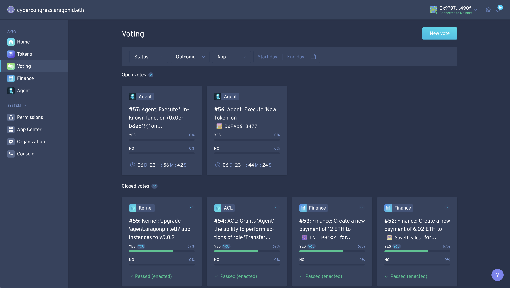

#### Votes for token deployemnt
[Vote #1](https://rinkeby.etherscan.io/tx/0x7ed48928db5c2a26643a627526be2b2d36f58f34d78371c0bb33f938c53dcba3) and [Vote #2](https://rinkeby.etherscan.io/tx/0x88788f46bded31c8469dd41edc68395f4cafe17292490e62efcca78dbd7913dd)


#### Votes for foundation deployemnt
[Vote #1](https://rinkeby.etherscan.io/tx/0xd2b8b5ecc123fd5c01fba0ca9d6c70c8db096d60cf84d79092fca77828d51064) and [Vote #2](https://rinkeby.etherscan.io/tx/0x46351e06a03b33f257b2f01592e5b9ff67ccd457e8720fd6261c3ffab086f618)


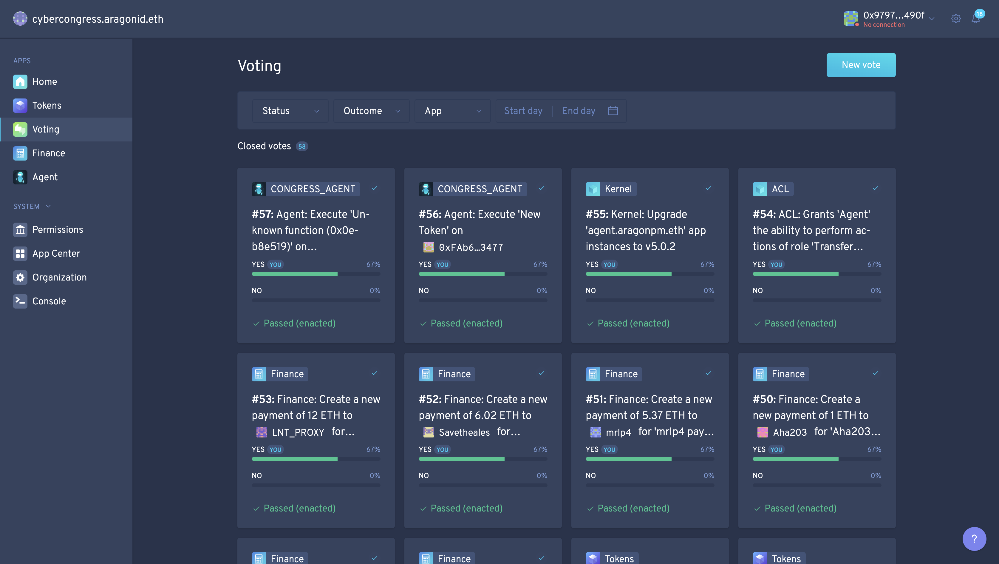

After the proposal has passed, the new DAO becomes [available](https://rinkeby.aragon.org/#/tgol26)


The initial and the major token holder here is the Congress Agent and the second one is a service account which was described previously.

#### Check the Foundation DAO
This command allows you to check the installed applications and the addresses of their instances, and also, check a permissionless application (an app which is installed and initialized, but still needs to have permissions set up, so it can start their operations).

Template of the command:

```
npx dao apps <kernelFoundationAddress> --all --environment aragon:<network>
```

Command (no tx cast):

```
npx dao apps 0x7961b06c10B41A99eF574f2372D279a48C1D0Ff8  --all --environment aragon:rinkeby
```

Output:

```
  ⠙ Inspecting DAO
  ✔ Inspecting DAO
  ✔ Fetching permissionless apps

✔ Successfully fetched DAO apps for 0x7961b06c10B41A99eF574f2372D279a48C1D0Ff8
┌──────────────────────┬────────────────────────────────────────────┬─────────────────────────────────────────────────────┐
│ App                  │ Proxy address                              │ Content                                             │
├──────────────────────┼────────────────────────────────────────────┼─────────────────────────────────────────────────────┤
│ kernel               │ 0x7961b06c10B41A99eF574f2372D279a48C1D0Ff8 │ (No UI available)                                   │
├──────────────────────┼────────────────────────────────────────────┼─────────────────────────────────────────────────────┤
│ acl                  │ 0x3c81424a236b8105ad089425552a5c5dc16f9bad │ (No UI available)                                   │
├──────────────────────┼────────────────────────────────────────────┼─────────────────────────────────────────────────────┤
│ evmreg               │ 0x7009e48641fb1f246639b60e859612192ee29384 │ (No UI available)                                   │
├──────────────────────┼────────────────────────────────────────────┼─────────────────────────────────────────────────────┤
│ token-manager@v2.1.7 │ 0xc53914fddba1357da7ccc09d193f3b72d5e652a6 │ ipfs:QmdLEDDfiH3RGjbgU5hqJwwALbNreMWupqTQCRGfNrMPiP │
├──────────────────────┼────────────────────────────────────────────┼─────────────────────────────────────────────────────┤
│ agent@v5.0.1         │ 0x53b892babeb4a7044ec23d0b0c7c53eeb0d0ecae │ ipfs:QmXBnAn37C813nLSHtLL3EcCsYSJS6k5kK15QcmD6DvHNZ │
├──────────────────────┼────────────────────────────────────────────┼─────────────────────────────────────────────────────┤
│ finance@v2.1.9       │ 0x63f83cee5f74f9439ac9dc11b58dd85fd7ca24b0 │ ipfs:QmbnhuLvvvcqEpRXd6VtnqZYAFZJdvAnhUrBAwqE1rfeRP │
├──────────────────────┼────────────────────────────────────────────┼─────────────────────────────────────────────────────┤
│ voting@v2.1.7        │ 0x7c2e8bec18dbe0d0fb1ba2920824444c164aaf7f │ ipfs:QmUvWBZqpKepDwS5WUsTTURwiBRvhoGRTjwJG7Em5TU2UJ │
└──────────────────────┴────────────────────────────────────────────┴─────────────────────────────────────────────────────┘
```

#### Voting by the Congress Agent in the Foundation
Create a proposal to vote `yes/no` as a  proposal in another DAO:

```
dao act <agentCongressAddress> <foundationVotingAppAddress>  "vote(uint256,bool,bool)" <id> <vote> <enact>  --environment aragon:<network>
```

*Note:* to forward the intent of the Congress DAO to another DAO, we will be using the Agent of the Congress. When anyone from the congress DAO will create a proposal to vote yes or no for, it will create a proposal in the other DAO (Foundation in this case) and call the Congress Agent to cast a vote. 

Creating in the congresses voting application an instance of another DAO and a proposal ID with a decision which needs to be applied (be voted on). After the proposal, the passing agent will forward the vote to the given proposal in another DAO.

It is also worth noting, that until we reach the burning stage of the balance of the service account, we will be applying the same process to every stage. 
____________

### Install the Vesting application for the Foundation DAO

#### Parameters

```
address _tokenManager,
uint64 _vestingEnd
```

Parameters:

- Token Manager: 0xc53914fddba1357da7ccc09d193f3b72d5e652a6
- Vesting End: Wednesday, April 1, 2020 1:00:00 AM GMT (1585702800)

*Note:* The Vesting application needs the token managers' address of the Foundation DAO because it creates vesting (which is the token managers' functionality) and calls on issue, assing and burn operations as the token manager (you can see which accounts are set as manager, and other rights, when we click on the proposal itself).

The Vesting end time is the time when tokens that are vested will be allowed for transfer. This set up follows a distribution agreement (the need for the auction to be completed) plus an extra period (a window for holders to make vesting after the auction ends, and the dust from the auction is provably burned by the Congress or passed to the balance of the Foundation agent). 
After vesting is over, the Congress will stop its commitment to provide claims for CYB tokens in the Cyber chain.

We strongly recommend you read Aragon's guides [about manager isntance](https://hack.aragon.org/docs/guides-custom-deploy)

#### Install the application
*Note:* this action is done by the service account (at this stage the Congress personal accounts cannot vote for the proposal anymore, so it is done with the agent)

Command template (cast tx):

```
npx dao install <kernelFoundationAddress> cyberclaim.open.aragonpm.eth latest --app-init-args <tokenManagerFoundationAddress> <vestingEnd> --environment aragon:rinkeby
```

Command (cast tx):

```
npx dao install 0x7961b06c10B41A99eF574f2372D279a48C1D0Ff8 cybervesting.open.aragonpm.eth latest --app-init-args 0xc53914fddba1357da7ccc09d193f3b72d5e652a6 1585702800 --environment aragon:rinkeby --use-frame
```

Output:

```
  ✔ Fetching cybervesting.open.aragonpm.eth@latest
  ✔ Fetching cybervesting.open.aragonpm.eth@latest
  ↓ Checking installed version [skipped]
    → Installing the first instance of cybervesting.open.aragonpm.eth in DAO
  ✔ Deploying app instance
  ↓ Fetching deployed app [skipped]
    → App wasn't deployed in transaction.

ℹ Successfully executed: "Execute desired action as a token holder"

⚠ After the app instance is created, you will need to assign permissions to it for it appear as an app in the DAO
```

[Transaction detail of the proposal to install the Vesting application in the Foundation](https://rinkeby.etherscan.io/tx/0x64eebe72bbafcbb863af13d5b635d82d404ebe9b36d96a93cd82891da6450dd1)

Proposal to install the Vesting application, created in the Foundation DAO:


We now need to vote for this proposal with the agent of the Congress. Anyone from the Cogress DAO creates a proposal and votes `yes` for this proposal of the Foundation DAO, in the Congress DAO.

Command template (cast tx):

```
dao act <agentCongressAddress> <foundationVotingAddress>  "vote(uint256,bool,bool)" <id> <vote> <enact>  --environment aragon:<network>
```

Command (cast tx):

```
dao act 0x988fbf6ee7219c0672351605ccc16060ed31d703 0x7c2e8bec18dbe0d0fb1ba2920824444c164aaf7f "vote(uint256,bool,bool)" 0 true true  --environment aragon:rinkeby --use-frame
```

Output:

```
  ⠙ Executing execute on 0xaAe1456bDEDaa40E2ecf20777Fab7Ec2f676477f
  ✔ Executing execute on 0xaAe1456bDEDaa40E2ecf20777Fab7Ec2f676477f

✔ Successfully executed: "Execute desired action as a token holder"
```

Here, any of the congressmen vote `yes` to the proposal in the cyber~Congress DAO for the vesting app to be installed in the Foundation DAO:
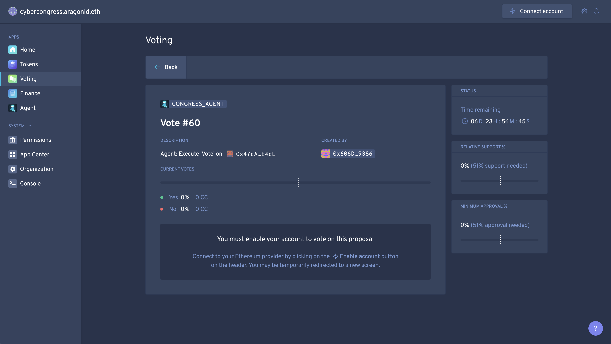

[Vote #1 Tx](https://rinkeby.etherscan.io/tx/0xc75f1096758c0dd37b033f623afc9321c568ec36e82f8b2186b1081e6d988dfa) and [Vote #2 Tx](https://rinkeby.etherscan.io/tx/0xf6accd0cf47b67415ae54ed486471cb55188335f505bf355abf0c9d3acdf6a00)

Proposal passed in the Foundation DAO:


*Note:* The Vesting application is still permissionless at this stage. To complete the installation process, we need to assign permissions for the Vesting application.

```
  ⠙ Inspecting DAO
  ✔ Inspecting DAO
  ✔ Fetching permissionless apps

✔ Successfully fetched DAO apps for 0x7961b06c10B41A99eF574f2372D279a48C1D0Ff8
┌──────────────────────┬────────────────────────────────────────────┬─────────────────────────────────────────────────────┐
│ App                  │ Proxy address                              │ Content                                             │
├──────────────────────┼────────────────────────────────────────────┼─────────────────────────────────────────────────────┤
│ kernel               │ 0x7961b06c10B41A99eF574f2372D279a48C1D0Ff8 │ (No UI available)                                   │
├──────────────────────┼────────────────────────────────────────────┼─────────────────────────────────────────────────────┤
│ acl                  │ 0x3c81424a236b8105ad089425552a5c5dc16f9bad │ (No UI available)                                   │
├──────────────────────┼────────────────────────────────────────────┼─────────────────────────────────────────────────────┤
│ evmreg               │ 0x7009e48641fb1f246639b60e859612192ee29384 │ (No UI available)                                   │
├──────────────────────┼────────────────────────────────────────────┼─────────────────────────────────────────────────────┤
│ token-manager@v2.1.7 │ 0xc53914fddba1357da7ccc09d193f3b72d5e652a6 │ ipfs:QmdLEDDfiH3RGjbgU5hqJwwALbNreMWupqTQCRGfNrMPiP │
├──────────────────────┼────────────────────────────────────────────┼─────────────────────────────────────────────────────┤
│ agent@v5.0.1         │ 0x53b892babeb4a7044ec23d0b0c7c53eeb0d0ecae │ ipfs:QmXBnAn37C813nLSHtLL3EcCsYSJS6k5kK15QcmD6DvHNZ │
├──────────────────────┼────────────────────────────────────────────┼─────────────────────────────────────────────────────┤
│ finance@v2.1.9       │ 0x63f83cee5f74f9439ac9dc11b58dd85fd7ca24b0 │ ipfs:QmbnhuLvvvcqEpRXd6VtnqZYAFZJdvAnhUrBAwqE1rfeRP │
├──────────────────────┼────────────────────────────────────────────┼─────────────────────────────────────────────────────┤
│ voting@v2.1.7        │ 0x7c2e8bec18dbe0d0fb1ba2920824444c164aaf7f │ ipfs:QmUvWBZqpKepDwS5WUsTTURwiBRvhoGRTjwJG7Em5TU2UJ │
└──────────────────────┴────────────────────────────────────────────┴─────────────────────────────────────────────────────┘
┌────────────────────────────────────────────────────────────────────┬────────────────────────────────────────────┐
│ Permissionless app                                                 │ Proxy address                              │
├────────────────────────────────────────────────────────────────────┼────────────────────────────────────────────┤
│ 0xb3898b383ac8a6bae742b41163ced5666086e3e367be1b3de9251c2dbc45d412 │ 0x7C2a661daC04aaE4381b810c3228cCaB1d11Deec │
└────────────────────────────────────────────────────────────────────┴────────────────────────────────────────────┘
```

#### Initialize Proof/Pause Roles
We need to give the app different permissions to interact with other apps. You can see them in /permissions/tokens.

There are different token roles that Aragon lets you use by default, like issue, assign, burn, etc. Apart from these roles, our newly created applications will need two extra roles that we have created:

__Pause Role__ : assigning this to the Congress Agent will allow the Congress to stop vesting and claiming operations of CYB tokens following a crisis protocol

__Proof Role__ : assigning this to the Congress driven external address, will allow the Congress to send tokens and then write transactions as proofs to any given vesting operations created by users

We are also setting manager rights for these roles to the congress agent (WHY?)

Command template (cast tx):

```
npx dao acl create <kernelFoundationAddress> <vestingApplicationAddress> PAUSE_ROLE <agentCongressAddress> <agentCongressAddress> --environment aragon:<network>
```

Command (cast tx):

```
dao acl create 0x7961b06c10B41A99eF574f2372D279a48C1D0Ff8 0x7C2a661daC04aaE4381b810c3228cCaB1d11Deec PAUSE_ROLE 0x988fbf6ee7219c0672351605ccc16060ed31d703 0x988fbf6ee7219c0672351605ccc16060ed31d703 --environment aragon:rinkeby --use-frame
```

Output:

```
  ⠙ Executing createPermission on 0x7961b06c10B41A99eF574f2372D279a48C1D0Ff8
  ✔ Executing createPermission on 0x7961b06c10B41A99eF574f2372D279a48C1D0Ff8

✔ Successfully executed: "Execute desired action as a token holder"
```

[Transaction detail on install PAUSE_ROLE on the Vesting application](https://rinkeby.etherscan.io/tx/0x9da2131301429862a12f510806ef8f262f07035cd5b68888a3a5802bdfa050df)

Command template (cast tx):

```
dao acl create <kernelFoundationAddress> <claimAppAddress> PROOF_ROLE <prooferAddress> <agentCongressAddress> --environment aragon:<network>
```

Command (cast tx):

```
dao acl create 0x7961b06c10B41A99eF574f2372D279a48C1D0Ff8 0x7C2a661daC04aaE4381b810c3228cCaB1d11Deec PROOF_ROLE 0x31c3F97575B7515a7e967f73Cb26c5BFD7898951 0x988fbf6ee7219c0672351605ccc16060ed31d703 --environment aragon:rinkeby --use-frame
```

Output:

```
  ⠼ Executing createPermission on 0x7eFA8E568a5fE91741f72A39b96f42EEdB67C419
  ✔ Executing createPermission on 0x7eFA8E568a5fE91741f72A39b96f42EEdB67C419

✔ Successfully executed: "Execute desired action as a token holder"
```

[Transaction detail of installing the PROOF_ROLE for the Vesting application](https://rinkeby.etherscan.io/tx/0xa6a085437705033b3fdbd181870edfff5081acfc81ac73c6f682f1fdcf21fcb8)

The created proposals in the Foundation DAO:


Create a proposal to vote on:

```
dao act 0x988fbf6ee7219c0672351605ccc16060ed31d703 0x7c2e8bec18dbe0d0fb1ba2920824444c164aaf7f "vote(uint256,bool,bool)" 1 true true  --environment aragon:rinkeby
```

```
  ⠙ Executing execute on 0xaAe1456bDEDaa40E2ecf20777Fab7Ec2f676477f
  ✔ Executing execute on 0xaAe1456bDEDaa40E2ecf20777Fab7Ec2f676477f

✔ Successfully executed: "Execute desired action as a token holder"
```

[Transaction detail of the creation of the voting in the Congress for setting up the PAUSE_ROLE for Vesting](https://rinkeby.etherscan.io/tx/0x3c56d2efe4888e581726fa583a679779860d7cc983b90620c865bc945faaf652)

Create a proposal to vote on:

```
dao act 0x988fbf6ee7219c0672351605ccc16060ed31d703 0x7c2e8bec18dbe0d0fb1ba2920824444c164aaf7f "vote(uint256,bool,bool)" 2 true true  --environment aragon:rinkeby
```

```
  ⠙ Executing execute on 0xaAe1456bDEDaa40E2ecf20777Fab7Ec2f676477f
  ✔ Executing execute on 0xaAe1456bDEDaa40E2ecf20777Fab7Ec2f676477f

✔ Successfully executed: "Execute desired action as a token holder"
```

[Transaction detail of the creation of voting in Congress, for setting the PROOF_ROLE for Vesting](https://rinkeby.etherscan.io/tx/0x3ca7290ab854b41da1f44f3bc2e0c5060532f3b759c24efc752d7032a83f0bb6)

The created proposals in the Congress DAO:


The passed proposals, which forward the `yes` votes to the Fondation DAO:


[Vote #1](https://rinkeby.etherscan.io/tx/0xaaf59921ab7c4e2b7663f0c6a3f7817dfcf04dd7bb514d94c7c10384bbcef2c6) and [Vote #2](https://rinkeby.etherscan.io/tx/0xe471ca20104850284f61e56f5781a3d527b41f1640edafc4fcbf8501338e7bfa)


[Vote #1](https://rinkeby.etherscan.io/tx/0x7e570798f37d9b3b4a85f33960058923d84358b3603042f33277ec7ef9ed80a2) and [Vote #2](https://rinkeby.etherscan.io/tx/0x1f9ff63ced2a86fac2cc0c3e2d8940ef1ea1ed16e33e6bae01442a5d705d9849)

The passed proposals in the Foundation DAO:
(we now see that the cyber~Vesting application is available)


Permissions for the Auction in the Foundation DAO, are now installed:
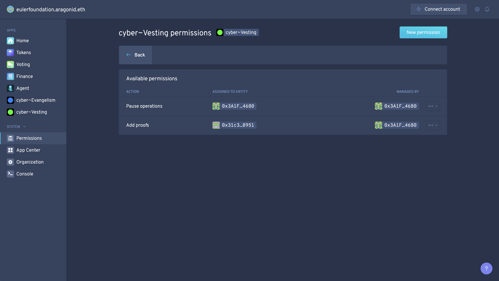

#### Grant permission to Issue/Assign/Burn as Token Manager
We need to grant the needed permissions to the Vesting application so it can perform the needed functions as Token Manager in the Foundation DAO (you may view different roles in `token permissions`).

*Note:* This action is done from the frontend of the application

1. Issue: initialize the Vesting Application and the Voting application entities as manager
2. Assing: initialize the Vesting Application as an entity and the Voting application as a manager
3. Burn: grant permission to the Vesting Application entity

*Why is this required?*

When someone wants to lock the tokens (vest them), under the hood, we must first burn thee tokens and then release the same amount in the token manager. And only then, give him those tokens with a vesting key. 


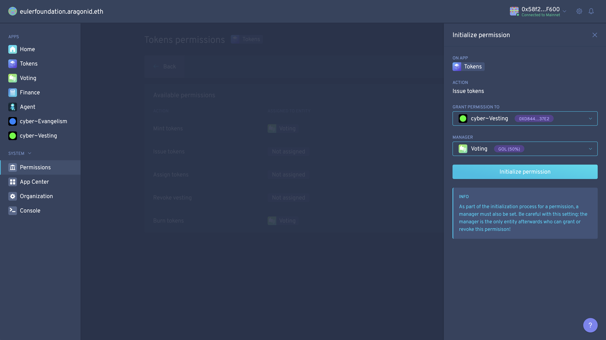
- [Transaction details](https://rinkeby.etherscan.io/tx/0xd8e1003152602e8bcccc006de2568d44f34e37951fe4f3a6ac70c65ab56d2ace)

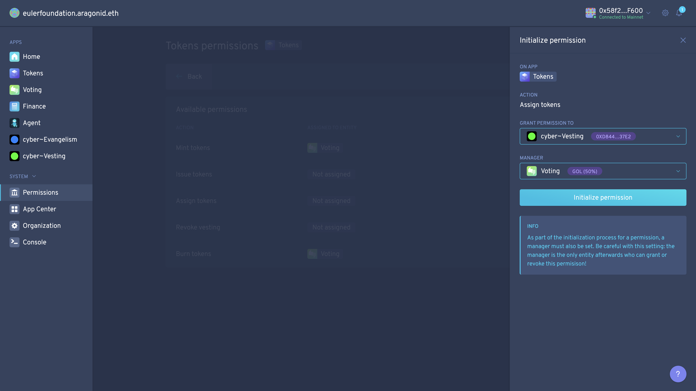
- [Transaction details](https://rinkeby.etherscan.io/tx/0x25344d300fb4477717be1d9523780a3a50b8457245a3bd348883433c6e269be5)


- [Transaction details](https://rinkeby.etherscan.io/tx/0x7385f2bdaaa52650b54f8b7f390e31c76ba65a36005aafc8d4826aea06e91cf2)

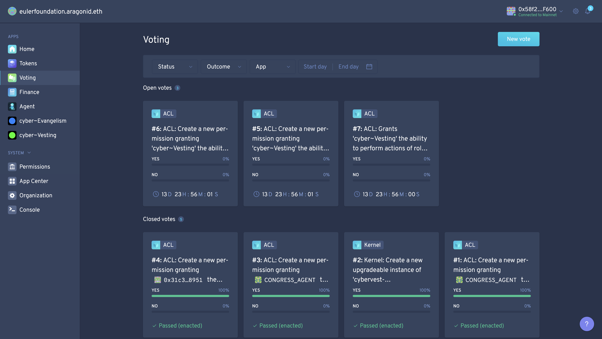

After this, create 3 votes:

```
dao act <agentCongressAddress> <foundationVotingAddress>  "vote(uint256,bool,bool)" <id> <vote> <enact>  --environment aragon:<network>
```

```
dao act 0x988fbf6ee7219c0672351605ccc16060ed31d703 0x7c2e8bec18dbe0d0fb1ba2920824444c164aaf7f "vote(uint256,bool,bool)" 3 true true  --environment aragon:rinkeby --use-frame
```

- [Transaction detail of creating the proposal on issuing token permissions](https://rinkeby.etherscan.io/tx/0xd3c9ed31d992fac397d9efb5b07691ebc563f4138f7c3361a3bbb7366b9a39fb)

```
dao act 0x988fbf6ee7219c0672351605ccc16060ed31d703 0x7c2e8bec18dbe0d0fb1ba2920824444c164aaf7f "vote(uint256,bool,bool)" 4 true true  --environment aragon:rinkeby --use-frame
```

- [Transaction detail of creating a proposal to assign tokens permissions](https://rinkeby.etherscan.io/tx/0xf09d530f2b76a59eeceb949ca63c94fe2abe6111b8dbe8d6be4dc66c9adf34fc)

```
dao act 0x988fbf6ee7219c0672351605ccc16060ed31d703 0x7c2e8bec18dbe0d0fb1ba2920824444c164aaf7f "vote(uint256,bool,bool)" 5 true true  --environment aragon:rinkeby --use-frame
```
- [Transaction detail of creating a proposal on Burn tokens permissions](https://rinkeby.etherscan.io/tx/0xee1015799d6b0cc13b0212399d130b78c7619b2590daa0a13589a18398a0dc6e)

Output:

```
  ⠸ Executing execute on 0xaAe1456bDEDaa40E2ecf20777Fab7Ec2f676477f
  ✔ Executing execute on 0xaAe1456bDEDaa40E2ecf20777Fab7Ec2f676477f

✔ Successfully executed: "Execute desired action as a token holder"
```


Members of the Congress DAO vote for these proposals and this forwards the `yes` votes to proposals, which then set permissions as Token Manager in the Foundation DAO, granting the required permissions for the Vesting application.


[Vote #1](https://rinkeby.etherscan.io/tx/0x2679df561fd4e4a0246a0e0173390d7d4f12fe122086a4cfe8ed629c452a798f) and [Vote #2](https://rinkeby.etherscan.io/tx/0x38b128d01e16e06fe60c841ddc3a16e21e351ead7129613e55842a76f1d3e613)


[Vote #1](https://rinkeby.etherscan.io/tx/0x51df69437bba518ddd93914919dc6666d7aac784a74c257d60392bb4a12c3896) and  [Vote #2](https://rinkeby.etherscan.io/tx/0xc172ecb9492189919df6f5ad3b2a973ceca8e4b1625a30165340d81cede8e142)


[Vote #1](https://rinkeby.etherscan.io/tx/0xd1bf9e7f063f7da9139143b9487bc572f4686d32730d80c9707b797c56572f15) and   [Vote #2](https://rinkeby.etherscan.io/tx/0xf234d5fb27d48413ecd78d0969765e22ba3337b54de712511d40bd9879f8058b)

The passed proposals in the Foundation DAO:


New permissions as Token Manager in the Foundation DAO:


Well done! The installation of the Vesting application for the Foundation DAO is completed! This application is now fully operational.
____________

### Installing the Auction application for the Foundation DAO

#### Parameters

```
uint256 _numberOfDays,
uint256 _openTime,
uint256 _startTime,
MiniMeToken _token,
address _foundation,
address _tokenManager
```

- The number of days is the amount of windows/rounds of any given time (23 hours + 1 second in our case). The auction will continue after the initial (zero) window
- Open time is the time when round zero will begin 
- Start time is the time when round zero will be finished and a following amount of rounds, equal to each other in terms of time, occurs
- The foundation address is the address to which the donated ETH will be transferred (Foundations DAO agent)

```
- numberOfDays - 20
- openTime -  1585245600 Thursday, March 26, 2020 6:00:00 PM GMT
- startTime - 1585591200 Monday, March 30, 2020 6:00:00 PM GMT
- token - Foundation token TGOL26 (0xf6e8E6730d8E3F48519f150215013d654d43a53B)
- foundation - Agent of Foundation (0x53b892babeb4a7044ec23d0b0c7c53eeb0d0ecae)
```

#### Install
We use the service account to create the proposal to install the app

Command template (cast tx):

```
dao install <kernel> cyberauction.open.aragonpm.eth latest --app-init-args <windows> <open> <start> <token> <agentFoundationAddress> <tokenManagerAddress> --environment aragon:rinkeby
```

Command (cast tx):

```
dao install 0x7961b06c10B41A99eF574f2372D279a48C1D0Ff8 cyberauction.open.aragonpm.eth latest --app-init-args 20 1585245600 1585591200 0xf6e8E6730d8E3F48519f150215013d654d43a53B 0x53b892babeb4a7044ec23d0b0c7c53eeb0d0ecae  0xc53914fddba1357da7ccc09d193f3b72d5e652a6 --environment aragon:rinkeby --use-frame
```

Output:

```
  ✔ Fetching cyberauction.open.aragonpm.eth@latest
  ✔ Fetching cyberauction.open.aragonpm.eth@latest
  ↓ Checking installed version [skipped]
    → Installing the first instance of cyberauction.open.aragonpm.eth in DAO
  ✔ Deploying app instance
  ↓ Fetching deployed app [skipped]
    → App wasn't deployed in transaction.

ℹ Successfully executed: "Execute desired action as a token holder"

⚠ After the app instance is created, you will need to assign permissions to it for it appear as an app in the DAO
```

[Transaction detail of creating a proposal in the Foundation DAO for installing the Auction application](https://rinkeby.etherscan.io/tx/0xe89535503a65ed5f3d9ec56510c1799c9b63f5eabdfeef1b1dffd5b0e282ab5c)

A proposal to install the Auction app is created in the Foundation DAO:


Now, we can create the voting with the agent of the Congress and vote `yes` in the Congress DAO:

Command (cast tx):

```
dao act 0x2d0970da60f36be926f78fbe8d6ef035eeaaf09f 0x519bc4f0b24f9bf5c093f7cfdaf962a3bd15f414 "vote(uint256,bool,bool)" 6 true true  --environment aragon:rinkeby
```

```
⠸ Executing execute on 0xaAe1456bDEDaa40E2ecf20777Fab7Ec2f676477f
  ✔ Executing execute on 0xaAe1456bDEDaa40E2ecf20777Fab7Ec2f676477f

✔ Successfully executed: "Execute desired action as a token holder"
```

[Transaction detail of creating a proposal in Congress to vote on the proposal in the Foundation, for installing the Auction application](https://rinkeby.etherscan.io/tx/0xb9d077e50861c457d9aae51033116f6a88b92717e9b9d5c44798fc7003e07298)

A created proposal to vote `yes` in Congress DAO:


A passed proposal in the Congress DAO:


[Vote 1](https://rinkeby.etherscan.io/tx/0xa78f1e393d0ad1dc1f951995b15ffada45605e6fad5d6cccf26f6f72d5dbfbaf) and [Vote 2](https://rinkeby.etherscan.io/tx/0x46ef0e1313b5a1529e09723cee2142842d9e64660256061106fabe9d08f09dd5)

A passed proposal in the Foundation DAO, for installing the Auction application:


```
➜  ~ npx dao apps 0x7eFA8E568a5fE91741f72A39b96f42EEdB67C419 --all --environment aragon:rinkeby
  ⠙ Inspecting DAO
  ✔ Inspecting DAO
  ✔ Fetching permissionless apps

✔ Successfully fetched DAO apps for 0x7961b06c10B41A99eF574f2372D279a48C1D0Ff8
┌──────────────────────────┬────────────────────────────────────────────┬─────────────────────────────────────────────────────┐
│ App                      │ Proxy address                              │ Content                                             │
├──────────────────────────┼────────────────────────────────────────────┼─────────────────────────────────────────────────────┤
│ kernel                   │ 0x7961b06c10B41A99eF574f2372D279a48C1D0Ff8 │ (No UI available)                                   │
├──────────────────────────┼────────────────────────────────────────────┼─────────────────────────────────────────────────────┤
│ acl                      │ 0x3c81424a236b8105ad089425552a5c5dc16f9bad │ (No UI available)                                   │
├──────────────────────────┼────────────────────────────────────────────┼─────────────────────────────────────────────────────┤
│ evmreg                   │ 0x7009e48641fb1f246639b60e859612192ee29384 │ (No UI available)                                   │
├──────────────────────────┼────────────────────────────────────────────┼─────────────────────────────────────────────────────┤
│ token-manager@v2.1.7     │ 0xc53914fddba1357da7ccc09d193f3b72d5e652a6 │ ipfs:QmdLEDDfiH3RGjbgU5hqJwwALbNreMWupqTQCRGfNrMPiP │
├──────────────────────────┼────────────────────────────────────────────┼─────────────────────────────────────────────────────┤
│ agent@v5.0.1             │ 0x53b892babeb4a7044ec23d0b0c7c53eeb0d0ecae │ ipfs:QmXBnAn37C813nLSHtLL3EcCsYSJS6k5kK15QcmD6DvHNZ │
├──────────────────────────┼────────────────────────────────────────────┼─────────────────────────────────────────────────────┤
│ finance@v2.1.9           │ 0x63f83cee5f74f9439ac9dc11b58dd85fd7ca24b0 │ ipfs:QmbnhuLvvvcqEpRXd6VtnqZYAFZJdvAnhUrBAwqE1rfeRP │
├──────────────────────────┼────────────────────────────────────────────┼─────────────────────────────────────────────────────┤
│ voting@v2.1.7            │ 0x7c2e8bec18dbe0d0fb1ba2920824444c164aaf7f │ ipfs:QmUvWBZqpKepDwS5WUsTTURwiBRvhoGRTjwJG7Em5TU2UJ │
├──────────────────────────┼────────────────────────────────────────────┼─────────────────────────────────────────────────────┤
│ cybervesting.open@v5.0.0 │ 0x7c2a661dac04aae4381b810c3228ccab1d11deec │ ipfs:Qmcz48Le7ZKYE4zX1e5eDc2ntyxKj294qG6NcUyBXMDLto │
└──────────────────────────┴────────────────────────────────────────────┴─────────────────────────────────────────────────────┘
┌────────────────────────────────────────────────────────────────────┬────────────────────────────────────────────┐
│ Permissionless app                                                 │ Proxy address                              │
├────────────────────────────────────────────────────────────────────┼────────────────────────────────────────────┤
│ 0x7d9a0e9523a9f617c1b16588b4c2365cd331ca2e83ba785d79136358163c18a0 │ 0xc13926630C1aFa229a0C4df8Df2ACbfF03C4681e │
└────────────────────────────────────────────────────────────────────┴────────────────────────────────────────────┘
```

We need to initialize permissions for the Auction application and grant the needed permissions as Token Manager.

#### Initialize the Creator Role
Here, we assign the Creator Role (which sets up the auction) to the Congress Agent. The creator can (and should) burn the dust tokens after the auction ends. 

cyber functions with very large numbers and non-divisible tokens, by dust we refer to anything that comes after a decimal point. As we cannot issue more tokens then there are, we round the amount to the closest lowest number after the decimal. I.E. if someone were to receive 1000000.3 or 1000000.7, they will always receive 1000000. The dust is provably burned, hence that value is actually returned to donors in terms of inflation washdown.  

Command template (cast tx):

```
dao acl create <kernelFoundationAddress> <auctionApplicationAddress> CREATOR_ROLE <agentCongress> <agentCongress> --environment aragon:rinkeby
```

Command (cast tx):

```
dao acl create 0x7961b06c10B41A99eF574f2372D279a48C1D0Ff8 0xc13926630C1aFa229a0C4df8Df2ACbfF03C4681e CREATOR_ROLE 0x988fbf6ee7219c0672351605ccc16060ed31d703 0x988fbf6ee7219c0672351605ccc16060ed31d703 --environment aragon:rinkeby --use-frame
```

Output:

```
  ⠼ Executing createPermission on 0x7961b06c10B41A99eF574f2372D279a48C1D0Ff8
  ✔ Executing createPermission on 0x7961b06c10B41A99eF574f2372D279a48C1D0Ff8

✔ Successfully executed: "Execute desired action as a token holder"
```


[Transaction detail of the creation of the Creator role for the Auction in the Foundation DAO](https://rinkeby.etherscan.io/tx/0x3a380855f5a2ceae6898a8697295b5f9f9d952a1862deaf14e6b804297ae7fe9)

#### Initialize Burner Role
We need to assign a Burner Role (which will burn dust tokens after auction end) to the Congress Agent.

Command template (cast tx):

```
dao acl create <kernelFoundationAddress> <auctionApplicationAddress> BURNER_ROLE <agentCongress> <agentCongress> --environment aragon:rinkeby
```

Command (cast tx):

```
dao acl create 0x7961b06c10B41A99eF574f2372D279a48C1D0Ff8 0xc13926630C1aFa229a0C4df8Df2ACbfF03C4681e BURNER_ROLE 0x988fbf6ee7219c0672351605ccc16060ed31d703 0x988fbf6ee7219c0672351605ccc16060ed31d703 --environment aragon:rinkeby --use-frame

```

Output:

```
  ⠼ Executing createPermission on 0x7961b06c10B41A99eF574f2372D279a48C1D0Ff8
  ✔ Executing createPermission on 0x7961b06c10B41A99eF574f2372D279a48C1D0Ff8

✔ Successfully executed: "Execute desired action as a token holder"
```


[Transaction detail of the creation of the Burner role for the Auction, in the Foundation DAO](https://rinkeby.etherscan.io/tx/0x389a6d1df1154fb3cc4df7be71639a90b5d76e29a5ee9c0646b4b09856a0d155)

Now, we can create the voting with the agent of the Congress and vote `yes` in the Congress DAO:

Command (cast tx):

```
dao act 0x988fbf6ee7219c0672351605ccc16060ed31d703 0x7c2e8bec18dbe0d0fb1ba2920824444c164aaf7f "vote(uint256,bool,bool)" 7 true true  --environment aragon:rinkeby
```

Command (cast tx):

```
dao act 0x988fbf6ee7219c0672351605ccc16060ed31d703 0x7c2e8bec18dbe0d0fb1ba2920824444c164aaf7f "vote(uint256,bool,bool)" 8 true true  --environment aragon:rinkeby
```

Output:

```
  ⠙ Executing execute on 0xaAe1456bDEDaa40E2ecf20777Fab7Ec2f676477f
  ✔ Executing execute on 0xaAe1456bDEDaa40E2ecf20777Fab7Ec2f676477f

✔ Successfully executed: "Execute desired action as a token holder"
```

The created proposal in the Congress DAO:


[Transaction detail of creating the proposal in Congress to vote on, for installing the Creator role for auction in the Foundation](https://rinkeby.etherscan.io/tx/0xf231a2520158f83aaa78317a5be731c4d5417b5879b32182f82fe450d3065976)

[Transaction detail of creating the proposal in the Congress to vote on, installing the Burner role for the auction in the Foundation](https://rinkeby.etherscan.io/tx/0xaaa91fe2f54142036a2efb3eaa4e0f8196dad2952b18a63284841f6b2f2e2557)

The passed proposal in the Congress DAO:


[Vote 1](https://rinkeby.etherscan.io/tx/0x353eba9a2aaa39d7d598f8f4f63404b83dfc681ec0a2fed2457a97d3ddbbeb87) and
[Vote 2](https://rinkeby.etherscan.io/tx/0x0d0cd99e7dc27673315fa09930c7a96f3f655d8c97a9b76c4f29a713fd51387b)


[Vote 1](https://rinkeby.etherscan.io/tx/0xef99551646fe8cb6c67ebee81f6387776b03aa39ade63dcabf528def1cfcf53a) and
[Vote 2](https://rinkeby.etherscan.io/tx/0xe9e9c8ee609bb2b54127e0f1b0aa68eb1a8837db1c6f1cd9714f69b3d909e4f0)

The passed proposal and the Auction app installed in the Foundation DAO:


Permissions of the Auction in the Foundation DAO:
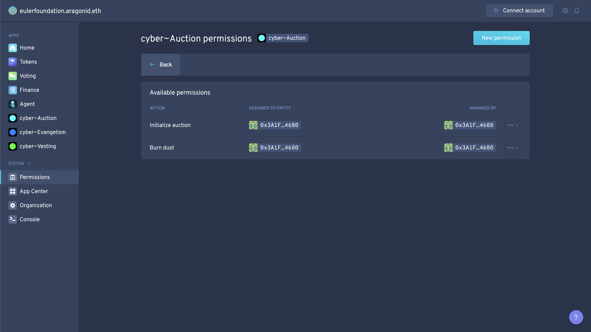

#### Grant permission for Burn rights as Token Manager
The auction should be able to burn tokens (dust) after the end. This role is assigned to the Congress Agent, but we need to grant permission as the Token Manager for the Auction.

Grant permission for Burn rights as Token Manager for the Auction application in the Foundation DAO:


[Transaction detail of creating the proposal to assign burn permission as the token manager, to the auction application in the Foundation](https://rinkeby.etherscan.io/tx/0xd50f085a0675157e9af14ec15ee6c358d1673b0ce6db6af0e1dacedfff49a8c1)

The created proposal to grant burn permission as the Token Manager for the Auction, in the Foundation DAO:
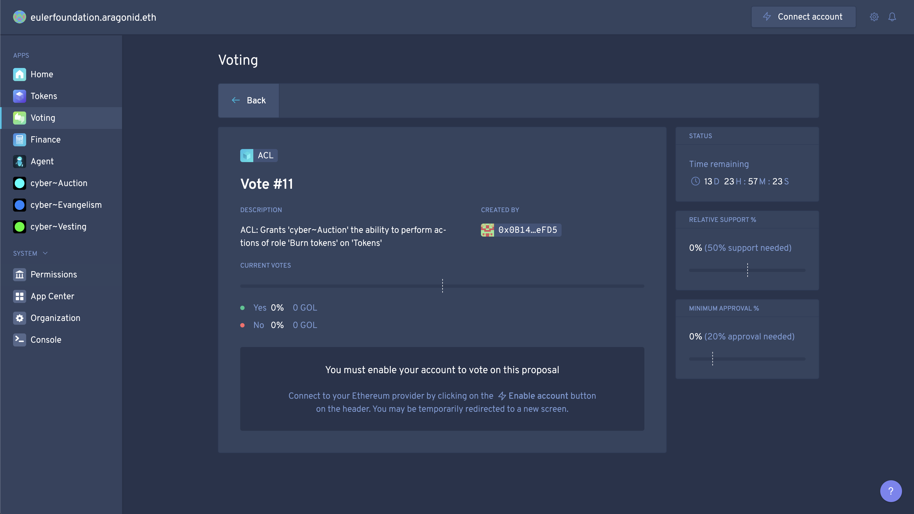

[Transaction detail of creating the proposal in Congress to vote on the proposal, to assign burn permissions as the Token Manager for the Auction](https://rinkeby.etherscan.io/tx/0xc3ff1d7dd12a719e0a4a3a69377fcff8fab93dd51cbe9dc7da2096eea97f8ad4)

We need to create a proposal in the Congress DAO to vote `yes` on, following the proposal in the Foundation DAO:

Command (cast tx):

```
dao act 0x988fbf6ee7219c0672351605ccc16060ed31d703 0x7c2e8bec18dbe0d0fb1ba2920824444c164aaf7f "vote(uint256,bool,bool)" 9 true true  --environment aragon:rinkeby --use-frame
```

Output:

```
  ⠙ Executing execute on 0xaAe1456bDEDaa40E2ecf20777Fab7Ec2f676477f
  ✔ Executing execute on 0xaAe1456bDEDaa40E2ecf20777Fab7Ec2f676477f

✔ Successfully executed: "Execute desired action as a token holder"
```

The created proposal in the Congress DAO:


The proposal passed in the Congress DAO, and forwarded it to the Foundation DAO:


[Vote 1](https://rinkeby.etherscan.io/tx/0x7f7a88464e7748475714bf3153ff6ed5f8afb748b21daa6d4916cc8ce117db6b) and
[Vote 2](https://rinkeby.etherscan.io/tx/0x03c57c5a8b462b69a0e89f7a4ea536780f5dbd8b271562c22f8b6111d39cc66e)

The passed proposal in the Foundation DAO:


The auction has permissions to burn tokens as Token Manager in the Foundation DAO:


#### Set the congress agent as app manager in the Foundation DAO
We need to assign a manager role to the Foundations kernel app. This is because the governance threshold will not allow us to pass any proposals for a long time because of the long-term distribution process. There may be bugs in contracts and it will be not possible for anyone to upgrade the applications.

This will allow the Congress to update the Auction or/and the Vesting applications in the Foundation in a case of an emergency. After the required amount of tokens will be distributed, the Congress will create a proposal to remove this permission from itself and ask the community to vote on the proposal. 

We are aware that this is a point of failure for a decentralized setup, however, we do not wish to risk the possibility of having a contract failure which will lead to loss of users funds or the foundations' funds. 

Creating a proposal to add permissions to manage the app in Foundations kernel:


[Transaction detail of allowing the Congress Agent to manage the app in the Foundation DAO](https://rinkeby.etherscan.io/tx/0xbc78af2195a8f0a025bc254afe801b9b25ca886caf9e7fbcf38326747aa37f74)

The created voting in the Foundation DAO:


We need to create a proposal in the Congress DAO, that we will vote `yes` on, set the Cogress Agent as the app mananger in the Foundation DAO:

Command (cast tx):

```
dao act 0x988fbf6ee7219c0672351605ccc16060ed31d703 0x7c2e8bec18dbe0d0fb1ba2920824444c164aaf7f "vote(uint256,bool,bool)" 11 true true  --environment aragon:rinkeby --use-frame
```

Output:

```
  ⠸ Executing execute on 0xaAe1456bDEDaa40E2ecf20777Fab7Ec2f676477f
  ✔ Executing execute on 0xaAe1456bDEDaa40E2ecf20777Fab7Ec2f676477f

✔ Successfully executed: "Execute desired action as a token holder"
```

[Transaction detail of the proposal in the Congress which allows the Congerss Agent to manage apps in the Foundation DAO](https://rinkeby.etherscan.io/tx/0x5f2671a403c7f48029810e7bff4742496468045d67d12df7c9697ca7b44810ab)

The created proposal in the Congress DAO:


The passed proposal in the Congress DAO:


[Vote 1](https://rinkeby.etherscan.io/tx/0x5ee147c4c7cbef5d6f9e46e230adfd2fd352bb04df9f31ae262f8d61bf09d903) and
[Vote 2](https://rinkeby.etherscan.io/tx/0xc88b440451738c7b6e3eb19d584bd572ae8644a5e3e64948401edc3e2008d2c1)

The passed proposal in the Foundation DAO:


List of kernel permissions in the Foundation DAO with the Congress Agent as apps manager:


#### Burn service account token in the Foundation DAO
*Note:* The service account has successfully completed its mission of the Foundation, Auction and Vesting applications setup and permission installation. Finalization of the Auction will be completed by the Congress itself because the Congress Agent has the needed permissions (CREATOR_ROLE and BURNER_ROLE) for the Foundations Auction.

Remove tokens from the service account:


Create a transaction and a proposal to remove 1 token from the service account:


[Transaction detail of removing 1 token from the service account in the Foundation DAO](https://rinkeby.etherscan.io/tx/0xb8dd1b1eb573a9ca912849ab58847cf1096e10a950a85eaf2d791263e3c16ba2)

The created proposal to burn 1 token from the service account in the Foundation DAO:


We need to create a proposal in the Congress DAO, that we will vote `yes` on, to burn 1 token from the service account in the Foundation DAO:

Command (cast tx):

```
dao act 0x988fbf6ee7219c0672351605ccc16060ed31d703 0x7c2e8bec18dbe0d0fb1ba2920824444c164aaf7f "vote(uint256,bool,bool)" 10 true true  --environment aragon:rinkeby --use-frame
```

Output:

```
  ⠙ Executing execute on 0xaAe1456bDEDaa40E2ecf20777Fab7Ec2f676477f
  ✔ Executing execute on 0xaAe1456bDEDaa40E2ecf20777Fab7Ec2f676477f

✔ Successfully executed: "Execute desired action as a token holder"
```

[Transaction detail of creating the proposal in the Congress to vote on the proposal, to remove 1 token from the service account in the Foundation DAO](https://rinkeby.etherscan.io/tx/0xe4b6e724f9536834fbb05ff619f06db21c346efac12bf6e465772f0f441ac649)

The created proposal in the Congress DAO:


The passsed proposal in the Congress DAO:


[Vote 1](https://rinkeby.etherscan.io/tx/0x069d0c7ed86846b765087b86b655cae7ed0d161fabb171eaf6cf1d05cb3026de) and
[Vote 2](https://rinkeby.etherscan.io/tx/0xe7685fedd1ad6f2fffbc5999cbd6e4bd0acb4495630aaf1b4f99ec2c14be9861)


The passed proposal to burn 1 token from the service account in the Foundation DAO:


The supply of the Foundation DAO now follows the required distribution:


#### Transfer tokens from the Congress Agent to the Auction contract
We can now transfer the needed amount of tokens to the Auction for further distribution.
 
600 TGOL24 will be transferred from the balance of the Congress Agent to Foundations Auction. The Congress Agent has permission to transfer their own token which we prepared beforehand in Congress.

You can get familiar with the distribution in detail [here](https://github.com/cybercongress/congress/blob/master/ecosystem/Cyber%20Homestead%20doc.md#moneybag-section-subtitle-beep-beep-beep).

Command template (cast tx):

```
dao act <agentCongress> <agentCongress> "transfer(address,address,uint256)" <tokenFoundationAddress> <auctionApplicationAddress> <amount> --environment aragon:rinkeby
```

Command (cast tx):

```
dao act 0x988fbf6ee7219c0672351605ccc16060ed31d703 0x988fbf6ee7219c0672351605ccc16060ed31d703 "transfer(address,address,uint256)" 0xf6e8E6730d8E3F48519f150215013d654d43a53B 0xc13926630c1afa229a0c4df8df2acbff03c4681e 600000000000000  --environment aragon:rinkeby --use-frame
```

Output:

```
  ⠧ Executing execute on 0x9cE69C31F98827eE5B8602988E07F8A0Af787035
  ✔ Executing execute on 0x9cE69C31F98827eE5B8602988E07F8A0Af787035

✔ Successfully executed: "Execute desired action as a token holder"
```

[Transaction detail of proposal to transfer Congress Agent foundation tokens to the auction in the foundation](https://rinkeby.etherscan.io/tx/0x85eba5c5e59babda59829b437fc782d724c1e85670716b48d1de753b89dee9be)

The created proposal to transfer a certain supply from the Congress Agent to the Auction in the Congress DAO:


The passed proposal to transfer a certain supply from the Congress Agent to the Auction in the Congress DAO:


[Vote 1](https://rinkeby.etherscan.io/tx/0x17e743014d548ccd5944a4199c3d3646607c40e1bc7db265b54e4cc06c1e2764) and
[Vote 2](https://rinkeby.etherscan.io/tx/0x5224d0479557016e12694756b2c022a5e7952e622640680cba94bcc2042a9cbf)

The supply is transferred to the Auction in the Foundation DAO:


The Foundations distribution is now completed and the Auction has the supply for the required distribution. 

The Congress team, the initial donors and the inventors of Cyber may participate in the governance of the Foundation with a proportion of tokens which they have following the numbers outlined in [Cybers whitepaper](https://ipfs.io/ipfs/QmceNpj6HfS81PcCaQXrFMQf7LR5FTLkdG9sbSRNy3UXoZ).

#### Load the Auction
The last step of the Auction setup. The supply has been already transferred and we may load the Auction with a given amount of Auction tokens to be distributed during round zero (ETH part of Game of Thrones). There will be 200 (tera) TGOL24 allocated for that part of the auction. The remaining amount will be equally split for other rounds (20 rounds of 23 hours + 1 sec).

*Note:* The Congress Agent has the permission to perform this action directly as we’ve set him the Creator_Role for Foundations auction. 

Command template (cast tx):

```
dao act <agentCongress> <auctionApplicationAddress> "load(uint256)" <amount> --environment aragon:rinkeby
```

Command (cast tx):

```
dao act 0x988fbf6ee7219c0672351605ccc16060ed31d703 0xc13926630c1afa229a0c4df8df2acbff03c4681e "load(uint256)" 200000000000000 --environment aragon:rinkeby --use-frame
```

Output:

```
  ⠸ Executing execute on 0xaAe1456bDEDaa40E2ecf20777Fab7Ec2f676477f
  ✔ Executing execute on 0xaAe1456bDEDaa40E2ecf20777Fab7Ec2f676477f

✔ Successfully executed: "Execute desired action as a token holder"
```

[Transaction detail of the load of the auction by the Congress as the creator of the auction](https://rinkeby.etherscan.io/tx/0xc3af4f3039749c991d1b6c4888c063323103f0b2adcd03897d9a3f6430c8888e)

The created proposal to load the Foundation Auction in the Congress DAO:


The passed proposal to load the Foundations Auction in the Congress DAO:


[Vote 1](https://rinkeby.etherscan.io/tx/0x6424742be1dbe15f69b9e065ff209c120f18d997c2726ef11adb564f7cb76aa7) and
[Vote 2](https://rinkeby.etherscan.io/tx/0xa61ee7e126d1d190027774f71c03fcedd76bae14b26e865262802ed3472e5d92)

#### Deploy and verify Auction Utils
An extra step for the Auction. We deploy an additional contract, which will provide a robust API to query Auction data from the Auction Contract. 

After the deployment of the contract, we will add the `AuctionUtils` contract address to the Auction (which will provide points of access to AuctionUtils from Auction). 

The [cyber.page appilication](https://cyber.page/) uses the `AuctionUtils` contract to provide statistics of the ongoing Auction (Aragon-based DApps use an event-driven state by design and don't need this). Such data includes amounts that were donated, claimed events and so on. Which basically, let’s cyber.page act as an explorer.

Code:

```
contract AuctionUtils {
    Auction public sale;

    constructor(Auction _sale) public {
        sale = _sale;
    }

    function dailyTotals() external view returns (uint[21] memory result) {
        for (uint i = 0; i < 21; i++) {
            result[i] = sale.dailyTotals(i);
        }
    }

    function userBuys(address user) external view returns (uint[21] memory result) {
        for (uint i = 0; i < 21; i++) {
            result[i] = sale.userBuys(i, user);
        }
    }

    function userClaims(address user) external view returns (bool[21] memory result) {
        for (uint i = 0; i < 21; i++) {
            result[i] = sale.claimed(i, user);
        }
    }
}
```

We will use Remix IDE for the deployemnt of `Auction Utils`:
Compiled Auction Utils in Remix IDE:
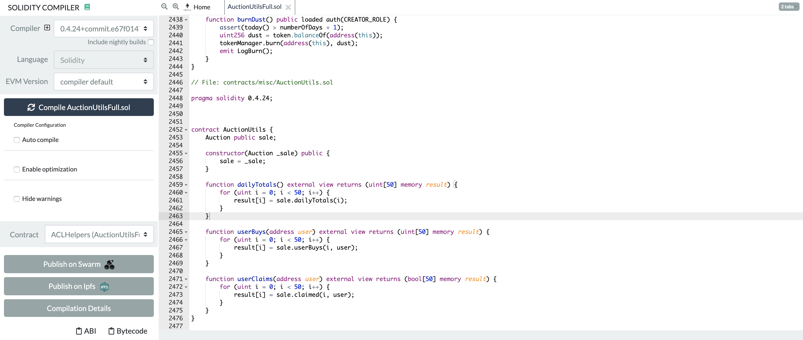

Deployment of `Auction Utils`:
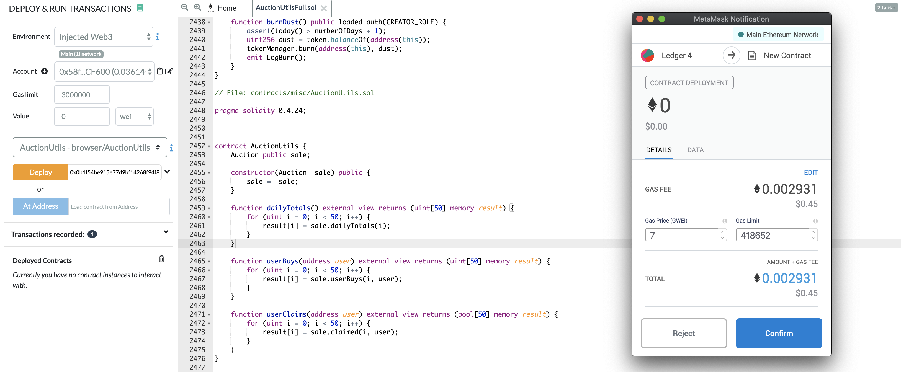

[Transaction detail of AuctionUtils deployment](https://rinkeby.etherscan.io/tx/0xe6da431baf335059e3e4847aebcad8045267dbcb297f4d78e570b90247ff7d3d)

`AuctionUtils` deployed with an initialized Auction address:


`AuctionUtils` contract: [0x5a9db7080db6c5b176795910343a74797dea1124](https://rinkeby.etherscan.io/address/0x5a9db7080db6c5b176795910343a74797dea1124)

Let's verify the contract. We will use a single file provided by truffle-flattener. Compiler v0.4.24+commit.e67f0147 without optimization.

Prepare the source code verification on Etherscan:


Verification on Etherscan has passed:


The verified contract:


#### Add `AuctionUtils` address to the Auction
Now, we add `AuctionUtils` address to the Auction. The Agent has direct access via the CREATOR_ROLE in Foundations Auction. The proposal for the Agents action will be created in Congress.

Command template (cast tx):

```
dao act <agentCongress> <auctionApplicationAddress> "addUtils(address)" <auctionUtilsAddress> --environment aragon:rinkeby
```

```
dao act 0x988fbf6ee7219c0672351605ccc16060ed31d703 0xc13926630c1afa229a0c4df8df2acbff03c4681e "addUtils(address)" 0x5a9db7080db6c5b176795910343a74797dea1124 --environment aragon:rinkeby --use-frame
```

Output:

```
  ⠼ Executing execute on 0xaAe1456bDEDaa40E2ecf20777Fab7Ec2f676477f
  ✔ Executing execute on 0xaAe1456bDEDaa40E2ecf20777Fab7Ec2f676477f

✔ Successfully executed: "Execute desired action as a token holder"
```

[Transaction detail of creating the proposal in the Congress DAO for adding `AuctionUtils` address to the Auction in the Foundation](https://rinkeby.etherscan.io/tx/0x55aa09da12abc9130b5321af668a5d81825c276ac8d6328018c4755867b29871)

Proposal to add the `AuctionUtils` contract address to the Foundation Auction from the Congress DAO:


The passed proposal to add the `AuctionUtils` contract address to  the Foundation Auction from the Congress DAO:


[Vote 1](https://rinkeby.etherscan.io/tx/0xe9a669c63faa8e27e7935293d1307df76bedff8093bd434a511c59768afeace7) and
[Vote 2](https://rinkeby.etherscan.io/tx/0x186fcbe03dda529336d8d296d8e676d6c55cd673ae9a6f3622f4131abf6f33b0)

---------------------

### Distribute tokens
The Congress can now finish the distribution process and transfer the tokens to the inventors and to the initial donors of Cyber. The remaining amount of the tokens are the share of the Congress itself, following the distribution outlined in Cybers whitepaper.

Command template (cast tx):

```
dao act <agentCongress> <agentCongress> "transfer(address,address,uint256)" <tokenFoundationAddress> <accountTo> <amountTokens> --environment aragon:rinkeby
```

#### Inventors
Command (cast tx):

```
dao act 0x988fbf6ee7219c0672351605ccc16060ed31d703 0x988fbf6ee7219c0672351605ccc16060ed31d703 "transfer(address,address,uint256)" 0xf6e8E6730d8E3F48519f150215013d654d43a53B 0xC41394F95FDd40193a2bf7Cb035f800CE1Edd908 10000000000000  --environment aragon:rinkeby --use-frame
```

Output:

```
  ⠸ Executing execute on 0xaAe1456bDEDaa40E2ecf20777Fab7Ec2f676477f
  ✔ Executing execute on 0xaAe1456bDEDaa40E2ecf20777Fab7Ec2f676477f

✔ Successfully executed: "Execute desired action as a token holder"
```

[Transaction detail of the transfer of tokens to the inventors 1](https://rinkeby.etherscan.io/tx/0xb941d08e1905f86f12387b192862d2d0000c978ba57bcf87f192977a0d2e7457)

Command (cast tx):

```
dao act 0x988fbf6ee7219c0672351605ccc16060ed31d703 0x988fbf6ee7219c0672351605ccc16060ed31d703 "transfer(address,address,uint256)" 0xf6e8E6730d8E3F48519f150215013d654d43a53B 0x47452dd11238f8db91e42d0b579d3fFF046Af499 10000000000000  --environment aragon:rinkeby --use-frame
```

Output:

```
  ⠸ Executing execute on 0xaAe1456bDEDaa40E2ecf20777Fab7Ec2f676477f
  ✔ Executing execute on 0xaAe1456bDEDaa40E2ecf20777Fab7Ec2f676477f

✔ Successfully executed: "Execute desired action as a token holder"
```

[Transaction detail of the transfer of tokens to the inventors 2](https://rinkeby.etherscan.io/tx/0xc06a338aaffad697a139cc0c047dae4cfd067d3ad1b6cd0d1623b554e3122a8b)

Congress members vote on transfer proposals in the Congress DAO.

Congressmen vote for transfers:


[Vote 1](https://rinkeby.etherscan.io/tx/0x26d00a6d8b183bf09d2223fffe547a722d2044f236f04157dcc81d4c5a785855) and
[Vote 2](https://rinkeby.etherscan.io/tx/0x5663a6d565c0f540ae40c3a2a537e400ccc2b574388304e28060f692b94d95b4)


[Vote 1](https://rinkeby.etherscan.io/tx/0x1993c8ac94c122b41862e891528e5df0fc5528f7e849df45a5761c5817ce5be9) and
[Vote 2](https://rinkeby.etherscan.io/tx/0xcb6d97120b04eb3c8aedcbac1223ffc9ee8e564a8209e79ad6375869a48ac754)

Foundation DAO and inventors have their tokens:


#### Initial donors

```
To be done in mainnet only
```
---------------------

### Final state

#### Foundation DAO
1. The foundation DAO is deployed by the agent of cyber~Congress Aragon DAO 
2. The foundation Aragon DAO name is TGOL26
3. Supply of TGOL26 is 700000000000000
4. An installed and prepared Auction Aragon application developed by cyber~Congress
5. An installed and prepared Vesting Aragon application developed by cyber~Congress
6. The permission manager on issuing tokens as Token Manager is set to Foundations Voting application
7. The permission manager on assigning tokens as Token Manager is set to Foundations Voting application
8. The Congress Agent has permission to manage apps in Kernel in a case when applications will require upgrades due to bugs


#### Vesting application
1. Vesting end period is set to Wednesday, April 1, 2020 1:00:00 AM GMT (1585702800)
2. The Vesting application PAUSE_ROLE is set to the Congress Agent. The role manager is the Congress Agent
3. The Vesting application PROOF_ROLE is set to the Congress Vesting, Companion Proofer external address. The role manager is the Congress Agent
4. The vesting app has permission to issue tokens as Foundations Token Manager
5. The vesting app has permission to assign tokens as Foundations Token Manager
6. The vesting app has permission to burn tokens as Foundations Token Manager

#### Auction application
1. Round zero of the Auction zero (Ethereum's Game of Thrones) is set to 1585245600 Thursday, March 26, 2020 6:00:00 PM GMT
2. Auction rounds start on 1585591200 Monday, March 30, 2020 6:00:00 PM GMT
3. Amount of rounds is set to 20+1 (window zero)
4. The duration of a round is 23 hours + 1 sec
5. The collector of funds is the Foundation DAO (Foundations Agent address)
6. The vesting app has permission to burn tokens as Foundations Token Manager
7. The Auction application CREATOR_ROLE is set to the Congress Agent. The manager of the role is the Congress Agent
7. The Auction application BURNER_ROLE is set to the Congress Agent. The manager of the  is the Congress Agent

#### Final thoughts
1. Aragon is an amazing project with endless features for the creation of DAOs and their operations
2. Use your own node, not Infura. This can boost the process 10x
3. Prepare yourself for this process. Take a rest before. You should be fully concentrated because there is no room for error


